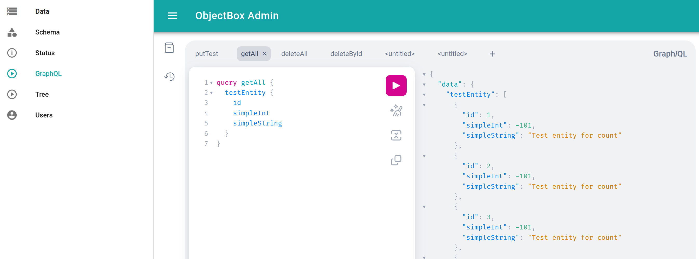
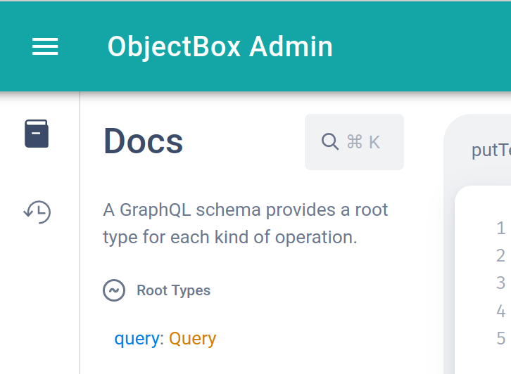

# GraphQL

ObjectBox Sync Server also offers a GraphQL database interface for clients. One can view it as an alternative to ObjectBox Sync in which clients access data in a more "traditional" way. Instead of having the data locally with ObjectBox Sync, a GraphQL client interacts with the data stored remotely at the ObjectBox server.

### GraphQL Playground

To get familiar with ObjectBox GraphQL, have a look at Admin web app. Select "GraphQL" from the main menu at the left hand side to start the GraphQL Playground. It allows to directly execute GraphQL queries and mutations on the data stored in the database.

<figure><figcaption></figcaption></figure>

As you can see, the GraphQL playground comes with some useful features:

* multiple tabs
* code formatting
* documentation explorer

To explore the GraphQL schema; simply click on the book icon:

<figure><figcaption></figcaption></figure>

Click on "Query" to see all available queries with their arguments.

### Queries, Mutations, etc.

Please check the sub pages on how to use ObjectBox as a GraphQL database.
