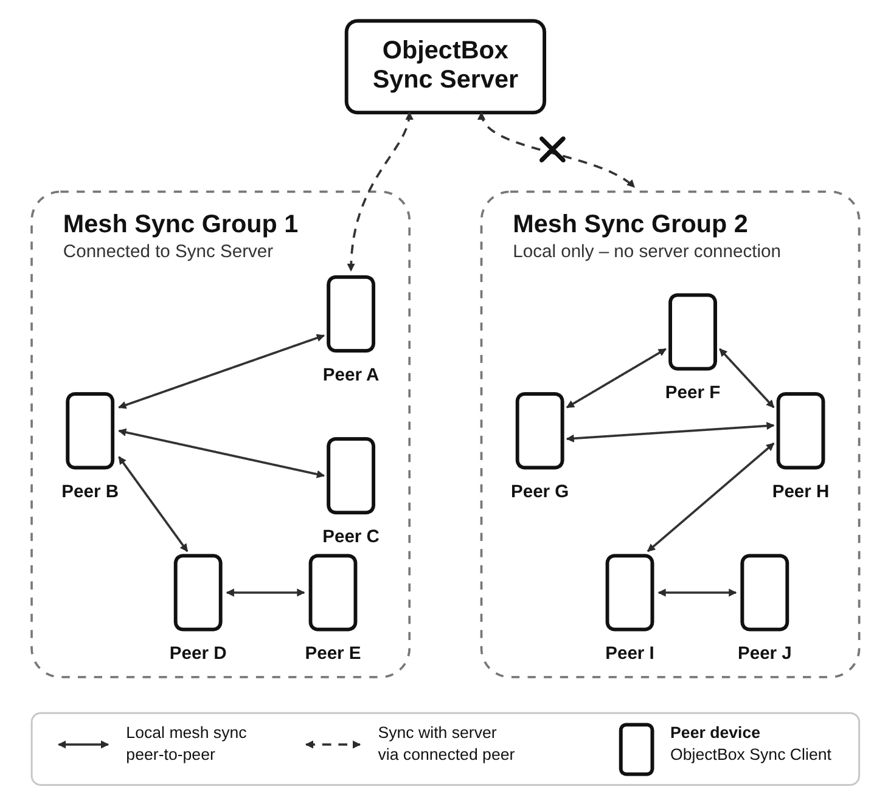

# Mesh Sync

Mesh Sync lets ObjectBox Sync clients synchronize directly with nearby peers (peer-to-peer, P2P).
It is intended for offline-first apps where devices may meet locally and exchange changes.
Typically, Mesh Sync is complementing the regular Sync Server by providing local sync while no Internet is available.


ObjectBox Mesh Sync is currently available as a **preview for Android** (Java/Kotlin and Flutter/Dart).
More platforms will follow; let us know if you are interested.
Please also note that the APIs are still subject to change until the final release.
For a list of current limitations, see [Current Limitations](#current-limitations).


## Overview

<figure><figcaption><p>Figure 1: ObjectBox Mesh Sync Overview</p></figcaption></figure>

Mesh Sync forms a local mesh network of devices to synchronize data between them.
It can use different technology stacks, such as Bluetooth (classic and BLE), Wi-Fi (LAN and Wi-Fi Aware) and others.
This allows data to move across devices even if not every device is directly connected to every other device.

Mesh Sync starts and stops together with the `SyncClient` and can coexist with regular Sync Server synchronization.

## Code: Initializing Mesh Sync

These minimal examples create the normal `SyncClient`, attach a mesh configuration and start syncing.
Use the same mesh identifier on all apps/devices that should join the same mesh.
The mesh ID should be unique to your application (for example, based on your application ID, like `com.example.myapp.mesh`).



```java
import io.objectbox.meshsync.android.AndroidMeshSync;
import io.objectbox.sync.MeshConfig;
import io.objectbox.sync.Sync;
import io.objectbox.sync.SyncClient;
import io.objectbox.sync.SyncCredentials;

MeshConfig meshConfig = AndroidMeshSync.createConfig(context, "com.example.myapp.mesh");

SyncClient syncClient = Sync.client(boxStore)
        .url("ws://sync.example.com:9999")
        .credentials(SyncCredentials.none())
        .mesh(meshConfig)
        .buildAndStart();
```



```kotlin
import io.objectbox.meshsync.android.AndroidMeshSync
import io.objectbox.sync.MeshConfig
import io.objectbox.sync.Sync
import io.objectbox.sync.SyncClient
import io.objectbox.sync.SyncCredentials

val meshConfig: MeshConfig = AndroidMeshSync.createConfig(context, "com.example.myapp.mesh")

val syncClient: SyncClient = Sync.client(boxStore)
    .url("ws://sync.example.com:9999")
    .credentials(SyncCredentials.none())
    .mesh(meshConfig)
    .buildAndStart()
```



```dart
import 'package:objectbox/objectbox.dart';
import 'package:objectbox_sync_flutter_libs/objectbox_sync_flutter_libs.dart'
    show createMeshConfig;

final mesh = await createMeshConfig('com.example.myapp.mesh');

final syncClient = SyncClient(
  store,
  ['ws://sync.example.com:9999'],
  [SyncCredentials.none()],
  mesh: mesh,
);

syncClient.start();
```



```cpp
#include "objectbox-sync.hpp"

obx::MeshOptions meshOptions("com.example.myapp.mesh");

// Provided by a platform SDK or custom transport integration.
meshOptions.registerNetwork(networkSharedPtr);

std::shared_ptr<obx::SyncClient> syncClient = obx::Sync::client(store)
    .url("ws://sync.example.com:9999")
    .credentials(obx::SyncCredentials::none())
    .mesh(std::move(meshOptions))
    .build();

syncClient->start();
```

Note: The C and C++ APIs expose the underlying mesh options, but a platform transport must be registered before creating the Sync client.
Do not use `obx_mesh_opt_network_internal()` directly unless your platform SDK or integration provides the required transport handle.



```c
#include "objectbox-sync.h"

OBX_sync_options* sync_opt = obx_sync_opt(store);
obx_sync_opt_add_url(sync_opt, "ws://sync.example.com:9999");

OBX_mesh_options* mesh_opt = obx_mesh_opt("com.example.myapp.mesh");

// Provided by a platform SDK or custom transport integration.
obx_mesh_opt_network_internal(mesh_opt, network_shared_ptr);

// obx_sync_opt_mesh() consumes mesh_opt, including when an error occurs.
obx_sync_opt_mesh(sync_opt, mesh_opt);

OBX_sync* sync_client = obx_sync_create(sync_opt);
obx_sync_credentials(sync_client, OBXSyncCredentialsType_NONE, NULL, 0);
obx_sync_start(sync_client);
```

Note: The C and C++ APIs expose the underlying mesh options, but a platform transport must be registered before creating the Sync client.
Do not use `obx_mesh_opt_network_internal()` directly unless your platform SDK or integration provides the required transport handle.




## Setup

Keep the regular ObjectBox Sync plugin and setup from [Sync Client](sync-client.md#objectbox-sync-enabled-library).

Mesh Sync is available starting with version `6.0.0-beta` of the ObjectBox Java and Dart libraries.



Use the Sync variant of ObjectBox version `6.0.0-beta` (or later), and add the Mesh Sync library for Android:

```kotlin
dependencies {
    implementation("io.objectbox:objectbox-meshsync-android:6.0.0-beta")
}
```

This library provides the mesh network for Android using [Google Nearby Connections](https://developers.google.com/nearby/connections/overview).
It also includes the required manifest permissions (see [Permissions](#permissions)) and the `play-services-nearby` dependency, so you do not need to add these yourself.



Use the Sync variant of ObjectBox version `6.0.0-beta` (or later), and add the Mesh Sync library for Android:

```groovy
dependencies {
    implementation "io.objectbox:objectbox-meshsync-android:6.0.0-beta"
}
```

This library provides the network transport for specific to Android.
It also includes the required manifest permissions (see [Permissions](#permissions)) and the `play-services-nearby` dependency, so you do not need to add these yourself.



Use version `6.0.0-beta` (or later) of the ObjectBox Dart packages, which contain Mesh Sync support:

```yaml
dependencies:
  objectbox: ^6.0.0-beta
  objectbox_sync_flutter_libs: ^6.0.0-beta
```

On Android, the `objectbox_sync_flutter_libs` plugin already includes the Mesh Sync library for Android,
with the required manifest permissions and the Google Nearby Connections dependency.



## Permissions

Mesh Sync may use Bluetooth, Wi-Fi and location-related Android permissions for discovery and connections.

The Mesh Sync library for Android declares the permissions that may be required by Nearby Connections in its manifest.
They are automatically merged into your app's manifest, so you do not need to declare them yourself.
This applies to both Android (Java/Kotlin) apps and Flutter apps.

For reference, these are the permissions added by the library:

```xml
<uses-permission android:name="android.permission.ACCESS_WIFI_STATE" />
<uses-permission android:name="android.permission.CHANGE_WIFI_STATE" />
<uses-permission android:name="android.permission.BLUETOOTH" />
<uses-permission android:name="android.permission.BLUETOOTH_ADMIN" />
<uses-permission android:name="android.permission.ACCESS_COARSE_LOCATION" />
<uses-permission android:name="android.permission.ACCESS_FINE_LOCATION" />
<uses-permission android:name="android.permission.BLUETOOTH_ADVERTISE" />
<uses-permission android:name="android.permission.BLUETOOTH_CONNECT" />
<uses-permission
    android:name="android.permission.BLUETOOTH_SCAN"
    android:usesPermissionFlags="neverForLocation" />
<uses-permission
    android:name="android.permission.NEARBY_WIFI_DEVICES"
    android:usesPermissionFlags="neverForLocation" />
```

Note that not all of these permissions may be required.
Depending on a device's Android version and your app's needs, only some of them may actually be necessary.
For example, location permissions are typically not required for Nearby Connections on recent Android releases.
To remove permissions your app does not need, use [merge rule markers](https://developer.android.com/build/manage-manifests) in your app's manifest:

```xml
<uses-permission
    android:name="android.permission.ACCESS_COARSE_LOCATION"
    tools:node="remove" />
<uses-permission
    android:name="android.permission.ACCESS_FINE_LOCATION"
    tools:node="remove" />
```

### Runtime Permissions

Request all dangerous (runtime) permissions before starting Mesh Sync.
On modern Android versions this typically includes nearby devices, Bluetooth scan/connect/advertise and location permissions.
Location services may also need to be enabled on the device for discovery to work reliably.

If permissions are only granted after the sync client has started, call `retryNetworks()` on the running mesh,
so it immediately retries starting its network radios.
(Advertising is also retried automatically with an increasing delay, see `advertisingRetryMillis` in [Configuration](#configuration).)



The `MeshSyncPermissions` helper class requests any missing runtime permissions and notifies the mesh once they are granted:

```kotlin
class ExampleActivity : Activity() {

    private val meshSyncPermissions = MeshSyncPermissions(this)

    override fun onRequestPermissionsResult(
        requestCode: Int,
        permissions: Array<out String>,
        grantResults: IntArray
    ) {
        super.onRequestPermissionsResult(requestCode, permissions, grantResults)
        meshSyncPermissions.notifyMeshIfPermissionsGranted(requestCode, syncClient.mesh)
    }

    fun onRequestPermissionsButtonClick() {
        meshSyncPermissions.requestIfMissing()
    }
}
```

If your app already [requests runtime permissions](https://developer.android.com/training/permissions/requesting) for other purposes,
you can instead use `MeshSyncPermissions.runtimePermissions()` (or `missingRuntimePermissions()`) with your own permission logic,
and call `MeshSync.retryNetworks()` once permissions are granted.


In Dart, `createMeshConfig()` requests the missing runtime permissions from the user via the system UI.
It does not wait for the user's decision: the mesh network is created immediately.
Pass an `onPermissionsGranted` callback to get notified once the user has granted (some of) the requested permissions;
it should call `retryNetworks()` on the running mesh:

```dart
SyncClient? syncClient;

final mesh = await createMeshConfig(
  'com.example.myapp.mesh',
  onPermissionsGranted: () => syncClient?.mesh?.retryNetworks(),
);

syncClient = SyncClient(
  store,
  ['ws://sync.example.com:9999'],
  [SyncCredentials.none()],
  mesh: mesh,
);
```

Alternatively, you can also implement your own permission request logic, and pass `false` to the `requestPermissions` parameter to prevent requesting runtime permissions.
Note that `createMeshConfig()` will only request runtime permissions if they are not already granted.




## Configuration

The mesh identifier controls which peers can discover each other.
Peers with different identifiers ignore each other.
Use different identifiers to isolate sync groups.

| Option                            | Default  | Description                                                                       |
|-----------------------------------|----------|-----------------------------------------------------------------------------------|
| `meshId`                          | Required | Mesh network identifier.                                                          |
| `maxConnectionCount`              | `3`      | Maximum number of simultaneous peer connections.                                  |
| `backoffMillis`                   | `10000`  | Delay before retrying a failed connection.                                        |
| `evictionBackoffMillis`           | `30000`  | Delay between peer evictions when a full peer makes room for a newcomer.          |
| `randomSeed`                      | `0`      | Random seed; `0` uses the current time.                                           |
| `requestTimeoutMillis`            | `5000`   | Timeout for requesting a missing sync log from a peer before trying another peer. |
| `advertisingDelayMillis`          | `2000`   | Delay before advertising starts after Mesh Sync starts.                           |
| `advertisingRetryMillis`          | `5000`   | Base delay before retrying advertising after it failed to start (e.g. due to missing permissions); retried with exponential backoff. |
| `advertisingRetryMaxMillis`       | `60000`  | Upper bound for the advertising retry backoff.                                    |
| `connectDelayMillis`              | `1000`   | Minimum delay between outgoing connection attempts.                               |
| `initialDiscoveryDurationSeconds` | `30`     | Duration of the first discovery phase; `0` means it does not stop by time.        |
| `discoveryDurationSeconds`        | `15`     | Duration of later discovery phases; `0` means they do not stop by time.           |
| `discoveryPauseSeconds`           | `45`     | Pause between discovery phases.                                                   |
| `discoveryPauseJitterSeconds`     | `15`     | Random positive or negative jitter applied to the discovery pause.                |
| `txLogBatchSizeKb`                | `100`    | Soft payload size cap for batching sync logs into a single transfer.              |
| `txLogBatchMaxCount`              | `1000`   | Maximum number of sync logs to batch into one transfer.                           |
| `txLogMaxAgeSeconds`              | `28800`  | Maximum age of sync logs kept in the local mesh storage (default: 8 hours).       |

The default `maxConnectionCount` of `3` is a good starting point for most meshes.
A value of `4` may improve fault tolerance, but it increases radio activity.
Values above `4` are usually not recommended.
A value of `1` creates pairs and is not a real mesh topology.

Set configuration options using the API for your language.
Note that not every option is exposed by every language API yet;
for example, the Java/Kotlin API currently does not expose `randomSeed` and `txLogMaxAgeSeconds`.
The following examples show how to configure a mesh and set `maxConnectionCount` to `4`.



Configure optional settings using the chainable setters of `MeshConfig`:

```java
MeshConfig meshConfig = AndroidMeshSync.createConfig(context, "com.example.myapp.mesh")
        .maxConnectionCount(4);
```



Configure optional settings using the chainable setters of `MeshConfig`:

```kotlin
val meshConfig = AndroidMeshSync.createConfig(context, "com.example.myapp.mesh")
    .maxConnectionCount(4)
```



```dart
final mesh = await createMeshConfig(
  'com.example.myapp.mesh',
  maxConnectionCount: 4,
);
```



```cpp
obx::MeshOptions meshOptions("com.example.myapp.mesh");
meshOptions.maxConnectionCount(4);
```



```c
OBX_mesh_options* mesh_opt = obx_mesh_opt("com.example.myapp.mesh");
obx_mesh_opt_max_connection_count(mesh_opt, 4);
```



If several devices start at the same time, give discovery and connection setup a little time.
Mesh Sync intentionally staggers advertising and outgoing connection attempts to reduce radio contention.

## Diagnostics

The running mesh can report its state and connected peer count.
Important states are `Created`, `Discovering`, `FullyConnected`, `Stopped` and `Dead`.
Useful counters include discovered peers, connected peers, failed connection attempts, sent and received messages, received sync logs and applied sync logs.



```java
MeshSync mesh = syncClient.getMesh();
if (mesh != null) {
    System.out.println(mesh.getStateString());
    System.out.println(mesh.getConnectedPeerCount());
    System.out.println(mesh.getStats(MeshStats.TX_LOGS_APPLIED));
}
```



```kotlin
val mesh: MeshSync? = syncClient.mesh
if (mesh != null) {
    println(mesh.stateString)
    println(mesh.connectedPeerCount)
    println(mesh.getStats(MeshStats.TX_LOGS_APPLIED))
}
```



```dart
final mesh = syncClient.mesh;
if (mesh != null) {
  print(mesh.stateString());
  print(mesh.connectedPeerCount());
  print(mesh.stats(MeshStats.txLogsApplied));
}
```



```cpp
obx::Mesh mesh = syncClient->mesh();
if (mesh.isAttached()) {
    std::cout << mesh.stateString() << std::endl;
    std::cout << mesh.connectedPeerCount() << std::endl;
    std::cout << mesh.statsU64(OBXMeshStats_txLogsApplied) << std::endl;
}
```



```c
OBX_mesh* mesh = obx_sync_mesh(sync_client);
if (mesh) {
    printf("%s\n", obx_mesh_state_string(mesh));
    printf("%zu\n", obx_mesh_connected_peer_count(mesh));

    uint64_t applied = 0;
    obx_mesh_stats_u64(mesh, OBXMeshStats_txLogsApplied, &applied);
    printf("Applied sync logs: %llu\n", (unsigned long long) applied);
}
```



## Current Limitations

Mesh Sync is currently in public preview.
Until the final release, we'll finalize the API and plan to address the following limitations.

* Only works on Android (Mesh Sync has a network abstraction layer that is currently only implemented for Android)
* Data expiration is time-based only: sync logs kept for the mesh expire after `txLogMaxAgeSeconds` (default: 8 hours);
  there is no size-based limit yet.
* TBD: Peer authentication; currently there's no auth between peers other than the mesh ID.
* TBD: the mesh ID (required at construction time) is the only mechanism to form sync groups.

## Related Pages

- [Sync Client](sync-client.md)
- [Troubleshooting Sync](troubleshooting-sync.md)
