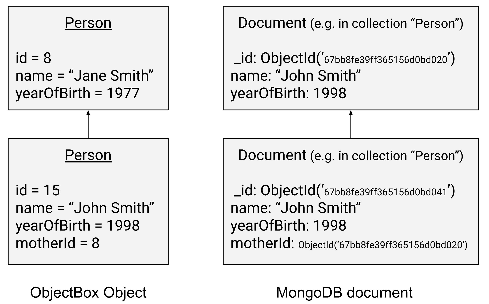

# MongoDB Sync Connector

ObjectBox Data Sync syncs data with MongoDB using the integrated [MongoDB Sync Connector](https://objectbox.io/mongodb/). Changes made on ObjectBox clients are synchronized in real-time to MongoDB and vice versa.


[Get your MongoDB Sync Connector Alpha](https://objectbox.io/mongodb/)


## Bi-directional Synchronization with MongoDB

<figure> ObjectBox Sync Server <--> ObjectBox Sync Client"><figcaption><p>ObjectBox Sync Connector for MongoDB: Architecture</p></figcaption></figure>

ObjectBox Sync brings your data in MongoDB to the edge (e.g. mobile and IoT devices, big and small servers) and synchronizes changes back to MongoDB. By using ObjectBox Sync, you can make your MongoDB data always available: continue to work offline and sync in real-time when online.

## Setup


**Do not connect to your MongoDB production instance!** Use a separate instance for testing purposes.


Configuring the MongoDB Sync Connector involves the following steps:

1. **Run the ObjectBox Sync Server&#x20;**_**without**_**&#x20;MongoDB Sync Connector** and validate it actually syncs data. See the [Sync Server configuration](sync-server-configuration/) for details.
2. **Ensure that your MongoDB instance is a replica set.** This is required for the MongoDB Sync Connector to work.
3. **Provide the MongoDB configuration**, e.g. the connection URL, to the Sync Server and restart it. This can be done via CLI arguments or the JSON configuration file (see below).
4. **Verify the MongoDB connection** using the Admin UI.

### The Data Model

In general, the ObjectBox Sync server requires a data model to be provided (a JSON file, see [objectbox-sync-server.md](objectbox-sync-server.md "mention")). This data model is also used by the MongoDB Sync Connector to map data between ObjectBox and MongoDB. On how this works, see the chapter on [data mapping](mongodb-sync-connector.md#syncing-and-mapping-data-with-mongodb) below.

### MongoDB Replica Set

Only a MongoDB replica set instance provides the necessary features for the MongoDB Sync Connector to work (e.g. MongoDB's change streams). Note that all **MongoDB Atlas clusters are already replica sets**, so you are good to go with them.

A local **standalone MongoDB instance** (MongoDB Community Edition is fine) can be converted to a replica set. You can do this either by following the [official MongoDB documentation](https://www.mongodb.com/docs/manual/tutorial/convert-standalone-to-replica-set/), or by following these simplified steps (tested on Ubuntu Linux) for a single node setup:

1. Stop the MongoDB service: `sudo systemctl stop mongod`
2. Edit the MongoDB configuration file: `sudo vi /etc/mongod.conf`
3.  Add the following lines to the configuration file:

    ```yaml
    replication:
      replSetName: "rs0"
    ```
4. Start the MongoDB service: `sudo systemctl start mongod`
5. Connect to the MongoDB shell: `mongosh`
6. Initialize the replica set via the MongoDB shell: `rs.initiate()`

### MongoDB Configuration

To configure the ObjectBox MongoDB Sync Connector via CLI arguments, you can use the following options:

* `--mongo-url`: The [MongoDB connection string](https://www.mongodb.com/docs/manual/reference/connection-string/) (URL or URI). This can be an empty string for the default `127.0.0.1:27017` host.
* `--mongo-db`: The primary MongoDB database name; the "database" containing the collections used for sync. By default this is "objectbox\_sync".


For the JSON configuration, ensure that the server version's date is 2024-10-07 or higher. Before that, you can use {"mongoUrl": "1.2.3.4"} without the `mongoDb` config node.


If you prefer doing this via `sync-server-config.json`, you need to add a new `mongoDb` config node, which contains key/value pairs for MongoDB specific configuration attributes:

```json
{
    ...
    "mongoDb": {
        "url": "1.2.3.4",
        "database": "db123"
    }
}
```

## Syncing and mapping data with MongoDB

### Difference in terminology and concepts

ObjectBox and MongoDB have many similarities. Nevertheless, it's important to understand the differences in terminology and concepts between the two databases. The following table illustrates these differences. It serves as background information on how to map things between the two systems:

<table><thead><tr><th width="186">Concept</th><th>ObjectBox</th><th>MongoDB</th></tr></thead><tbody><tr><td><strong>Database</strong> containing the data</td><td>A <strong>store</strong>, grouped into types (data classes).</td><td>A <strong>database</strong>, grouped into collections.</td></tr><tr><td><strong>What your application "opens"</strong></td><td>Using a name or directory a single store (database) is opened locally on device. (In the case of Sync, this is the "client database".)<br>Multiple stores can be opened, which are strictly separate.</td><td>A client is used to connect to a MongoDB server. All databases can be accessed on the server remotely.</td></tr><tr><td><strong>Arranging data in a database (e.g. data sets)</strong></td><td>A <strong>box</strong> holds all objects of the same <strong>type</strong>. A type typically matches a data class in programming languages.<br>It's part of a <strong>strict schema</strong> (data model) that is enforced. The type definition consists of a fixed set of <strong>properties</strong>.</td><td><strong>Collections</strong> are used to group documents together. By default, no strict rules are imposed (<strong>schema-less</strong>).</td></tr><tr><td><strong>Data record</strong></td><td>An <strong>object</strong> is an instance of a type. It can have data values for the <strong>properties</strong> defined in the type. </td><td>A <strong>document</strong> is a set of data values called <strong>fields</strong>. It's very similar to a JSON file.</td></tr><tr><td><strong>Modelling related data</strong></td><td>Objects can have <strong>to-one and to-many relationships</strong> to other objects. Relationships are bidirectional. Data is typically <strong>normalized</strong>.</td><td>Typically, a document <strong>embeds</strong> all "related data" into itself resulting in larger documents. Data is typically <strong>not normalized</strong>. Alternatively, one can also choose to use references, which is more similar to relationships.</td></tr><tr><td><strong>Nested data records</strong></td><td>Nested data is supported by <strong>flex properties.</strong> E.g. these allow maps, which can contain nested data structures (JSON-like).</td><td>Documents contain nested data <strong>by default</strong>.</td></tr><tr><td><strong>Identifiers (IDs)</strong></td><td>IDs are <strong>64-bit integers.</strong><br>They are unique within its box and database instance.</td><td>Typically, Mongo's <strong>Object ID</strong> (OID) consists of 12 bytes. Other ID types are supported.<br>OIDs are considered globally unique.</td></tr></tbody></table>

### Mapping data from MongoDB

The data model used by ObjectBox defines types, which are mapped to MongoDB collections. Similarly, the properties of a type are mapped to keys inside a MongoDB document. Thus, you should **ensure that the ObjectBox data model matches the MongoDB schema**. E.g. if you have an existing MongoDB database, ensure to match the names when you create the ObjectBox model.

#### Objects and Documents

When you compare the data structure of simple data elements, the difference is not big. Without nested data, the main difference you will note is the ID type.

<figure><figcaption></figcaption></figure>

Note: nested documents are supported via the ObjectBox "Flex" property type, which can hold a map-like (JSON-like) structure. We are also considering alternatives to this, so let us know if you have specific requirements.

#### ID mapping

ObjectBox automatically maps IDs when syncing with an external system like MongoDB. This way, both systems continue to work with their native ID types. This means that by default, the MongoDB ID is not present in ObjectBox objects and vice versa. Note that ObjectBox Sync also applies [internal ID mapping](advanced/object-ids.md) on each ObjectBox device.

ID mapping also happens for relations (starting with version Alpha 3 of MongoDB Sync Connector). Consider ObjectBox to-one relations, which have a single relation property pointing to another object using a 64-bit integer ID. This will become a reference field in MongoDB's document containing the MongoDB object ID (OID). See the following illustration for an example:

<figure><figcaption></figcaption></figure>


ObjectBox IDs are only valid on their local device. Do not store them manually apart from relations, e.g. as a custom list or vector, when you want to sync to other devices.



