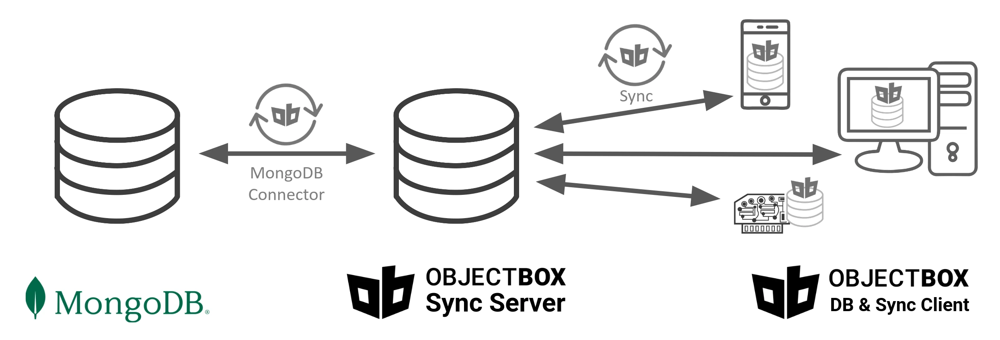

# MongoDB Sync Connector

ObjectBox Data Sync syncs data with MongoDB using the integrated [MongoDB Sync Connector](https://objectbox.io/mongodb/). Changes made on ObjectBox clients are synchronized in real-time to MongoDB and vice versa.


[Get your MongoDB Sync Connector Alpha](https://objectbox.io/mongodb/)


## Bi-directional Synchronization with MongoDB

<figure> ObjectBox Sync Server <--> ObjectBox Sync Client"><figcaption><p>ObjectBox Sync Connector for MongoDB: Architecture</p></figcaption></figure>

ObjectBox Sync brings your data in MongoDB to the edge (e.g. mobile and IoT devices, big and small servers) and synchronizes changes back to MongoDB. By using ObjectBox Sync, you can make your MongoDB data always available: continue to work offline and sync in real-time when online.

## Roadmap

If you are coming from Atlas Device Sync, you already now that it [reaches its end-of-life](https://www.mongodb.com/docs/atlas/app-services/deprecation/) on **September 30, 2025**. Thus, it's a good idea to [contact ObjectBox asap](https://objectbox.io/mongodb/) to get started with your migration.

While ObjectBox Sync is an established product, the MongoDB Connector is in its early stages. You can still get started with POCs or integrations right away. The timeline below enables you to align your development with ours and pick up speed. Once new features are out, you profit immediately.

<table><thead><tr><th width="134.93328857421875">Planned Date</th><th width="94.73333740234375" align="center">Released</th><th width="148.5333251953125">Connector Version</th><th>Main features</th></tr></thead><tbody><tr><td>Oktober 2024</td><td align="center"><span data-gb-custom-inline data-tag="emoji" data-code="2705">✅</span></td><td>Alpha 1</td><td>Two-way sync between MongoDB and ObjectBox for changes that are happening live.</td></tr><tr><td>January 2025</td><td align="center"><span data-gb-custom-inline data-tag="emoji" data-code="2705">✅</span></td><td>Alpha 2</td><td>JWT authentication, Mapping for all MongoDB data types</td></tr><tr><td>February 2025</td><td align="center"><span data-gb-custom-inline data-tag="emoji" data-code="2705">✅</span></td><td>Alpha 3</td><td>Relation mapping (to-one and many-to-many)</td></tr><tr><td>March 2025</td><td align="center"><span data-gb-custom-inline data-tag="emoji" data-code="2705">✅</span></td><td>Alpha 4</td><td>Support for additional MongoDB ID types</td></tr><tr><td>April 2025</td><td align="center"><span data-gb-custom-inline data-tag="emoji" data-code="2705">✅</span></td><td>Alpha 5 (2025-04-01)</td><td>Use MongoDB transactions, better change tracking, improved error handling, improved MongoDB Admin page</td></tr><tr><td>May 2025</td><td align="center"><span data-gb-custom-inline data-tag="emoji" data-code="2705">✅</span></td><td>Beta 1<br>(2025-05-05)</td><td>Import initial data from MongoDB, pick-up sync at any point. New admin page for full-syncs.</td></tr><tr><td>End of May 2025</td><td align="center"></td><td>Beta 2</td><td>Server-side rules to select data for sync per user</td></tr><tr><td>June 2025</td><td align="center"></td><td>1.0</td><td>Initial release incorporating most important user feedback</td></tr></tbody></table>

We'll update the plan regularly.

## Setup


**Do not connect to your MongoDB production instance!** Use a separate instance for testing purposes.


Setting up Sync server and its MongoDB Sync Connector involves the following steps:

1. [**Create and provide a Data Model to Sync Server**](./#create-and-provide-a-data-model-to-sync-server) using a model JSON file.
2. [**Run and test Sync Server**](./#run-and-test-sync-server) _without_ connecting to MongoDB and validate it actually syncs data.
3. [**Ensure that your MongoDB instance is a replica set**](./#ensure-that-your-mongodb-instance-is-a-replica-set)**.** This is required for the MongoDB Sync Connector to work.
4. [**Configure the MongoDB connection and run Sync Server**](./#configure-the-mongodb-connection-and-run-sync-server)**.** E.g. provide the connection URL to the Sync Server and restart it. This can be done via CLI arguments or the JSON configuration file.
5. [**Verify the MongoDB connection**](./#verify-the-mongodb-connection) using the Admin UI.

Read on for details.

### **Create and** Provide a Data Model to Sync Server

In general, the ObjectBox Sync server requires a data model to be provided (a JSON file, see [objectbox-sync-server.md](../objectbox-sync-server.md "mention")). This data model is also used by the MongoDB Sync Connector to map data between ObjectBox and MongoDB. On how this works, see the chapter on [data mapping](./#syncing-and-mapping-data-with-mongodb) below.

### **Run and test Sync Server**

To avoid any later issues, run and test Sync Server without connecting to MongoDB and your client application and validate data is synced.

See the [objectbox-sync-server.md](../objectbox-sync-server.md "mention") page on how to run Sync Server.

### Ensure that your MongoDB instance is a Replica Set


**MongoDB Atlas clusters** are already replica sets, no additional configuration is required.


Only a MongoDB replica set instance provides the necessary features for the MongoDB Sync Connector to work (e.g. MongoDB's change streams).

A local **standalone MongoDB instance** (MongoDB Community Edition is fine) can be converted to a replica set. You can do this either by following the [official MongoDB documentation](https://www.mongodb.com/docs/manual/tutorial/convert-standalone-to-replica-set/), or by following these simplified steps (tested on Ubuntu Linux) for a single node setup:

1. Stop the MongoDB service: `sudo systemctl stop mongod`
2. Edit the MongoDB configuration file: `sudo vi /etc/mongod.conf`
3.  Add the following lines to the configuration file:

    ```yaml
    replication:
      replSetName: "rs0"
    ```
4. Start the MongoDB service: `sudo systemctl start mongod`
5. Connect to the MongoDB shell: `mongosh`
6. Initialize the replica set via the MongoDB shell: `rs.initiate()`

### Configure the MongoDB connection and run Sync Server

To configure the ObjectBox MongoDB Sync Connector **via CLI arguments** when starting Sync Server (see [objectbox-sync-server.md](../objectbox-sync-server.md "mention")), you can use the following options:

* `--mongo-url`: The [MongoDB connection string](https://www.mongodb.com/docs/manual/reference/connection-string/) (URL or URI). This can be an empty string for the default `127.0.0.1:27017` host.
* `--mongo-db`: The primary MongoDB database name; the "database" containing the collections used for sync. By default this is "objectbox\_sync".


If you are using Docker on Windows/macOS to run an instance of the ObjectBox Sync server, use `host.docker.internal` as the host in the MongoDB connection string for the `--mongo-url` parameter, for example,

```bash
docker run --rm -it \
    --volume "$(pwd):/data" \
    --user $UID \
    --publish 127.0.0.1:9999:9999 \
    --publish 127.0.0.1:9980:9980 \
    objectboxio/sync:sync-server-${sync_server_version} \
    --model /data/objectbox-model.json \
    --unsecured-no-authentication \
    --admin-bind 0.0.0.0:9980 \
    --mongo-url mongodb://host.docker.internal:27017 \
    --mongo-db test-db
```

It enables the Sync server running within the container to access the MongoDB instance running on the host system. Note, **it only works on Windows and macOS**.


Alternatively, configure the MongoDB connection in the Sync Server configuration file (see [sync-server-configuration](../sync-server-configuration/ "mention")). In your `sync-server-config.json`, add a new `mongoDb` node which contains key/value pairs for MongoDB specific configuration attributes:

```json
{
    ...
    "mongoDb": {
        "url": "1.2.3.4",
        "database": "db123"
    }
}
```


If your Sync server version's date is lower than 2024-10-07, use `{"mongoUrl": "1.2.3.4"}` without the `mongoDb` config node.


### **Verify the MongoDB connection**

Use the ObjectBox Sync Server [Admin web app](../objectbox-sync-server.md#admin-web-ui) to verify the MongoDB connection works.

## Syncing and mapping data with MongoDB

### Difference in terminology and concepts

ObjectBox and MongoDB have many similarities. Nevertheless, it's important to understand the differences in terminology and concepts between the two databases. The following table illustrates these differences. It serves as background information on how to map things between the two systems:

<table><thead><tr><th width="186">Concept</th><th>ObjectBox</th><th>MongoDB</th></tr></thead><tbody><tr><td><strong>Database</strong> containing the data</td><td>A <strong>store</strong>, grouped into types (data classes).</td><td>A <strong>database</strong>, grouped into collections.</td></tr><tr><td><strong>What your application "opens"</strong></td><td>Using a name or directory a single store (database) is opened locally on device. (In the case of Sync, this is the "client database".)<br>Multiple stores can be opened, which are strictly separate.</td><td>A client is used to connect to a MongoDB server. All databases can be accessed on the server remotely.</td></tr><tr><td><strong>Arranging data in a database (e.g. data sets)</strong></td><td>A <strong>box</strong> holds all objects of the same <strong>type</strong>. A type typically matches a data class in programming languages.<br>It's part of a <strong>strict schema</strong> (data model) that is enforced. The type definition consists of a fixed set of <strong>properties</strong>.</td><td><strong>Collections</strong> are used to group documents together. By default, no strict rules are imposed (<strong>schema-less</strong>).</td></tr><tr><td><strong>Data record</strong></td><td>An <strong>object</strong> is an instance of a type. It can have data values for the <strong>properties</strong> defined in the type.</td><td>A <strong>document</strong> is a set of data values called <strong>fields</strong>. It's very similar to a JSON file.</td></tr><tr><td><strong>Modelling related data</strong></td><td>Objects can have <strong>to-one and to-many relationships</strong> to other objects. Relationships are bidirectional. Data is typically <strong>normalized</strong>.</td><td>Typically, a document <strong>embeds</strong> all "related data" into itself resulting in larger documents. Data is typically <strong>not normalized</strong>. Alternatively, one can also choose to use references, which is more similar to relationships.</td></tr><tr><td><strong>Many-to-many relationships</strong></td><td><strong>Fully supported</strong>. Unlike to-one relationships, the data is stored <strong>outside the object</strong>. Updating relations is very <strong>efficient</strong>. There's <strong>no user-defined order</strong> and <strong>no duplicates</strong>.</td><td><strong>Alternative modelling</strong> by embedding or referencing documents. <strong>Inside the document</strong>, you can have an array of IDs in a <strong>user-defined order</strong> allowing <strong>duplicates</strong>.</td></tr><tr><td><strong>Nested data records</strong></td><td>Nested data is supported by <strong>flex properties.</strong> E.g. these allow maps, which can contain nested data structures (JSON-like).</td><td>Documents contain nested data <strong>by default</strong>.</td></tr><tr><td><strong>Identifiers (IDs)</strong></td><td>IDs are <strong>64-bit integers.</strong><br>They are unique within its box and database instance.</td><td>MongoDB uses <strong>Object ID</strong> (short: OID; 12 bytes) by default and supports other ID types. OIDs are unique within their collection and likely globally unique.</td></tr></tbody></table>

### Mapping data from MongoDB

The data model used by ObjectBox defines types, which are mapped to MongoDB collections. Similarly, the properties of a type are mapped to keys inside a MongoDB document. Thus, you should **ensure that the ObjectBox data model matches the MongoDB schema**. E.g. if you have an existing MongoDB database, ensure to match the names when you create the ObjectBox model.

#### Objects and Documents

When you compare the data structure of simple data elements, the difference is not big. Without nested data, the main difference you will note is the ID type.

<figure><figcaption></figcaption></figure>

Note: nested documents are supported via the ObjectBox "Flex" property type, which can hold a map-like (JSON-like) structure. We are also considering alternatives to this, so let us know if you have specific requirements.

#### ID mapping

ObjectBox Sync automatically maps IDs when syncing with an external system like MongoDB. This way, you can use the native IDs in each system, 64-bit integer IDs in ObjectBox and e.g. 12-byte object IDs in MongoID. This also means that MongoDB ID is not present in ObjectBox objects and vice versa.


ObjectBox IDs are only valid on their local device. Do not store them manually (apart from relations) e.g. as a custom list or vector, when you want to sync to other devices.\
For details, you can refer to the [internal ID mapping docs](../advanced/object-ids.md) that happens on each ObjectBox device.


Besides the Object ID, ObjectBox supports most common ID types offered by MongoDB. IDs of **incoming documents from MongoDB** are automatically detected and mapped to ObjectBox local IDs. This mapping is persisted and thus any change made on the ObjectBox side can be mapped back to the initial ID type and value.

For **newly created (inserted) objects on the ObjectBox side,** a new MongoDB object ID (OID) is created by default. You can customize the MongoDB ID types in the ObjectBox data model: for the ID property, define a "external property type" on the ID property. E.g. a definition of the ID field in the ObjectBox entities would look similar like this pseudo code (syntax varies according to programming language):

```
@Id @ExternalType(UUID) int64 id;
```

The following table shows the supported ID types:

<table><thead><tr><th width="198.5333251953125">MongoDB type</th><th width="216.6998291015625" align="center">Incoming from MongoDB</th><th align="center">IDs for new documents created in ObjectBox</th></tr></thead><tbody><tr><td>Object ID</td><td align="center"><span data-gb-custom-inline data-tag="emoji" data-code="2705">✅</span></td><td align="center"><span data-gb-custom-inline data-tag="emoji" data-code="2705">✅</span><br>This is the default type</td></tr><tr><td>UUID (Binary with UUID subtype)</td><td align="center"><span data-gb-custom-inline data-tag="emoji" data-code="2705">✅</span></td><td align="center"><span data-gb-custom-inline data-tag="emoji" data-code="2705">✅</span><br>External types: Uuid (V7) or UuidV4</td></tr><tr><td>String</td><td align="center"><span data-gb-custom-inline data-tag="emoji" data-code="2705">✅</span></td><td align="center"><span data-gb-custom-inline data-tag="emoji" data-code="2705">✅</span><br>External types: UuidString (V7) or UuidV4String</td></tr><tr><td>Binary</td><td align="center"><span data-gb-custom-inline data-tag="emoji" data-code="2705">✅</span></td><td align="center">Uses default MongoDB Object Id</td></tr><tr><td>Int64</td><td align="center"><span data-gb-custom-inline data-tag="emoji" data-code="2705">✅</span></td><td align="center">Uses default MongoDB Object Id</td></tr><tr><td>Int32</td><td align="center"><span data-gb-custom-inline data-tag="emoji" data-code="2705">✅</span></td><td align="center">Uses default MongoDB Object Id</td></tr></tbody></table>

#### To-One Relations


If you want to learn more about ObjectBox relations, check the [relation documentation](https://docs.objectbox.io/relations).


ObjectBox Sync also happens automatically maps IDs used in relations (starting with version Alpha 3 of MongoDB Sync Connector).

Consider ObjectBox to-one relations, which have a single relation property pointing to another object using a 64-bit integer ID. This becomes a reference field in MongoDB's document containing the MongoDB object ID (OID). See the following illustration for an example:

<figure><figcaption><p>To-One Relationship Example: motherId</p></figcaption></figure>

The supported ID types also apply for relations, e.g. a "Person" document would have an UUID as the \_id field value, relations to it would also use the UUID as the relation ID on the MongoDB side.

#### Many-to-Many Relations

Many-to-many relations work a bit different. As illustrated in the table above, many-to-many relations work differently in ObjectBox and MongoDB. For mapping between the following rules apply:

* On the MongoDB side, many-to-many relations are stored as an array of ID references:
  * The IDs are stored inside the document "owning" the relationship.
  * The owning side of a relationship is always the same type (collection).
  * If you want to, you can make this relation bidirectional, by adding IDs to the "target side" of the relationship. Just do not make this visible in the ObjectBox data model.
* On the ObjectBox side, its native many-to-many relationships are used:
  * They are bidirectional, e.g. you can define it on the owning and target side.
  * They can be updated efficiently without touching the object
  * They can be used in queries to link types (aka join).

As to-many relations consist of ID values, all supported types can be used. In theory, different ID types can be used in the same to-many, relation. However, it's usually good practice to stick to a single ID type per MongoDB collection if possible.
