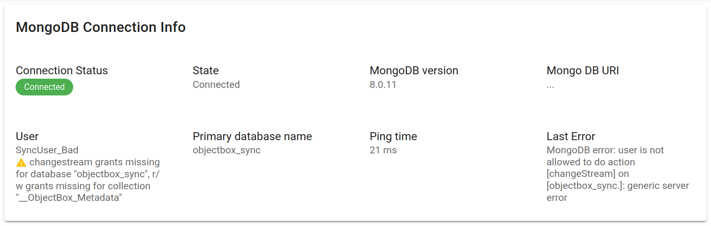

# MongoDB Configuration

In short, the ObjectBox Sync Connector only needs two things:

1. An existing MongoDB Atlas instance or a local MongoDB instance configured as a replica set.
2. A MongoDB connection URL (and thus a MongoDB user account).

## Supported MongoDB

You need at least MongoDB 5.0 or higher. If possible, use the latest 8.0 release as it provides the best performance and most of our testing happens here. Otherwise, versions 5.0 to 7.0 are also tested automatically and supported. However, we may drop support for 5.0 in the future. Contact us if you need to use an older version.

ObjectBox Sync Connector supports all MongoDB variants:

* MongoDB Community Edition (self-hosted)
* MongoDB Enterprise Advanced (self-hosted)
* MongoDB Atlas or similar cloud services (hosted)

Note: you can use the [MongoDB Atlas](https://www.mongodb.com/products/platform/atlas-database) Cloud service, which offers a free tier (M0) that is known to work well with the MongoDB Sync Connector.

## Separate MongoDB Instance for Testing

It is highly recommended to use a separate MongoDB instance for testing the ObjectBox Sync Connector. Switch to a production MongoDB instance only after everything has been thoroughly tested and confirmed to be working correctly.

It is common to start with a local MongoDB instance during the development process for quick roundtrips and tests.

## Ensure that your MongoDB instance is a Replica Set


**MongoDB Atlas clusters** are already replica sets, no additional configuration is required.


If you use a local MongoDB instance (e.g. a local instance or via Docker), it likely is not a replica set yet.
Only a MongoDB replica set instance provides the necessary features for the MongoDB Sync Connector to work (e.g. MongoDB's change streams).

A local **standalone MongoDB instance** (MongoDB Community Edition is fine) can be converted to a replica set. You can do this either by following the [official MongoDB documentation](https://www.mongodb.com/docs/manual/tutorial/convert-standalone-to-replica-set/), or by following these simplified steps (tested on Ubuntu Linux) for a single node setup:

1. Stop the MongoDB service: `sudo systemctl stop mongod`
2. Edit the MongoDB configuration file: `sudo vi /etc/mongod.conf`
3.  Add the following lines to the configuration file:

    ```yaml
    replication:
      replSetName: "rs0"
    ```
4. Start the MongoDB service: `sudo systemctl start mongod`
5. Connect to the MongoDB shell: `mongosh`
6. Initialize the replica set via the MongoDB shell: `rs.initiate()`

Note: If you are running MongoDB within a Docker container, the general principle of enabling replica set mode still applies. You would typically modify the MongoDB configuration file used by the Docker container or pass appropriate command-line arguments to `mongod` when starting the container to initiate it as a replica set. Consult the documentation for the specific MongoDB Docker image you are using for precise instructions.

## Prepare a user account for the MongoDB Sync Connector

It is recommended to use a separate MongoDB user account for the MongoDB Sync Connector. To create a MongoDB user account, see [MongoDB User Accounts](https://www.mongodb.com/docs/manual/tutorial/create-users/).
The user must have certain privileges, for which you have two options, which we will discuss next:

* Database-level privileges: simple to set up, e.g. for evaluating and to quickly get started
* Collection-level privileges: more granular control, safer

### Database-level privileges

This is the easiest way to set up a user account for the MongoDB Sync Connector:
give the user the `readWrite` role on the database being synchronized.
The `readWrite` is a built-in role that gives read and write access to all collections in the database.

A disadvantage of the database level user config is that you may give more grants than strictly necessary to the user.
On the other hand this setup is convenient during development, when new types/collection are added as it requires no changes.

### Collection-level privileges

If you have additional collections in the database, which you do not want to synchronize with ObjectBox, granting privileges on the collection level is an alternative. 
Ensure that the user account has read and write access to the database and collections that you want to synchronize.

The setup requires three steps (all are required):

1. Grant the `readWrite` role on each of the collections that take part in syncing.
   ObjectBox obviously needs to read and write to the collections during sync.
2. Grant the `readWrite` role on the collection named `__ObjectBox_Metadata`.
   The ObjectBox Sync Connector will store a few small metadata documents in this collection.
3. Grant the `find` and `changeStream` action on the database, e.g. by defining a custom role for the database.
   Using the predefined `read` role works too, but we recommend to keep the grants as narrow as possible.
   This is required for the change stream processing, which allows ObjectBox to receive updates from MongoDB (in "real-time").

Note: When new types/collections are added, do not forget to update the grants for the user!

### Use the configured user 

Once the user account is set up, you can get the MongoDB connection URL for the [ObjectBox Sync Connector setup](objectbox-sync-connector-setup.md), which is the next step.

### Troubleshooting user privileges

If you encounter errors, the MongoDB status page in the Admin UI should be the first place to check.
This page shows you potential issues with the user privileges and also the last error message:

<figure><figcaption><p>Figure 1: Example when MongoDB user grants are missing</p></figcaption></figure>

If this does not help, please enable debug logs (see [troubleshooting sync](../troubleshooting-sync.md)) and check the logs for irregular messages.

#### Change stream processing

Issue: Changes from MongoDB do not sync to ObjectBox (after the full sync was made).

Error 1: "Could not start change stream processing (operation error code 13): not authorized on objectbox_sync to execute command { aggregate: 1, pipeline: [ { $changeStream: ..."

Error 2: "Could not start change stream processing (operation error code 8000): user is not allowed to do action [changeStream] on ..."

Solution (primary): Double-check if the `find` and `changeStream` actions are granted to the database for the user. See the section on collection-level privileges above for details. 

Solution (alternative; try the primary solution first): In the Atlas UI, edit the database user and either disable "Restrict Access to Specific Clusters/Federated Database Instances/Stream Processing Instances", or, if the UI allows it, enable the Stream Processing Instances.
