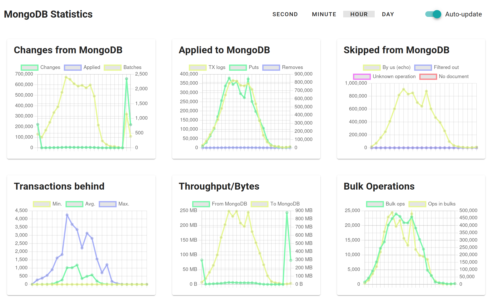
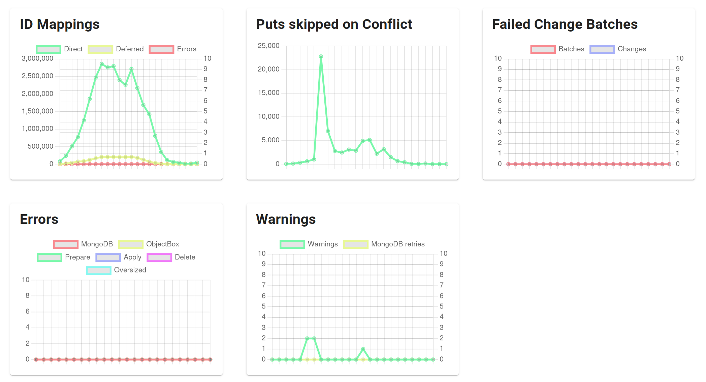

# MongoDB Statistics

The MongoDB Statistics page of the Admin web UI shows charts about the data flow between ObjectBox and MongoDB.
Open it via "MongoDB Connector" → "Statistics" in the menu on the left.

Use the charts to verify that changes are synchronized in both directions,
to keep an eye on the connector's performance and health,
and to spot errors and warnings when something does not work as expected.
The charts complement the [Sync Statistics](../sync-server/README.md#sync-statistics) page,
which covers the Sync clients connected to the server.

<figure><figcaption>
MongoDB Statistics: data flow charts
</figcaption></figure>

## Using the charts

At the top of the page, select the time resolution of the charts: "Second", "Minute", "Hour", or "Day".
Each data point covers one interval, e.g. a data point of the "Hour" charts sums up the counts of one hour.
The server keeps the last 60 seconds, 60 minutes, 24 hours, and 30 days in memory;
thus, the statistics start from scratch when the server restarts.

With "Auto-update" enabled, the page polls the server while the browser tab is visible;
a new data point appears when an interval of the selected resolution is complete,
e.g. around every minute in the "Minute" charts.
Turn it off to freeze the charts, e.g. to have a closer look at a peak.

Some charts combine values of different magnitudes and thus have two y-axes;
the chart descriptions below tell which series use the right axis.
Charts showing bytes automatically scale to KB, MB, or GB.

Errors and warnings counted in the charts are also recorded as [log events](../sync-server/admin-web-ui/log-events.md),
which provide details on what went wrong.

## Data flow charts

The first six charts show the data flow in both directions and are the ones to check regularly.

### Changes from MongoDB

This chart covers the direction from MongoDB to ObjectBox:
the connector receives changes made in MongoDB via a change stream and applies them to ObjectBox.

* **Changes**: changes received from the MongoDB change stream by anyone but the Sync Server itself.
  These are the inserts, updates, replaces, and deletes in collections that are part of the ObjectBox data model.
* **Applied**: changes that actually changed data in ObjectBox.
  This is typically identical to "Changes".
  The difference are changes without effect, e.g. deletes for documents unknown to ObjectBox
  (see "Delete" in the [Errors](#errors) chart) or changes that were already covered by a full import.
* **Batches** (right axis): changes from MongoDB are collected and applied to ObjectBox in batches,
  using one ObjectBox transaction per batch.
  A batch contains all changes that arrived since the previous batch was taken (certain limits apply).
  Thus, many changes per batch indicate a burst of changes that was processed efficiently.
  Batching also means fewer transactions for Sync clients to process.

### Applied to MongoDB

This chart covers the direction from ObjectBox to MongoDB:
the connector follows the sync history of the server and writes the changes to MongoDB.

* **Transactions**:
  transactions from the sync history that were applied to MongoDB.
  Transactions that originate from MongoDB itself are skipped, as their changes are already in MongoDB,
  and thus not counted.
* **Puts** and **Removes** (right axis): the object operations inside these transactions,
  i.e. inserts or updates of documents (puts) and deletes of documents (removes).

The values are counted once the write to MongoDB succeeded;
a transaction that is retried after a MongoDB error is counted only once.

### Skipped from MongoDB

Changes received from the MongoDB change stream that were not applied to ObjectBox:

* **By us (echo)**: changes written to MongoDB by the Sync Server itself.
  MongoDB delivers them via the change stream like any other change, and the connector recognizes and ignores them.
  This is normal and expected: the values go up with the operations in the "Applied to MongoDB" chart.
* **Filtered out**: changes in collections that are not part of the ObjectBox data model, or in other databases.
* **Unknown operation**: change stream events with an operation type other than insert, update, replace, and delete.
* **No document**: changes for which the change stream did not carry the document,
  and the document does not exist in MongoDB anymore.
  Typically, the document was deleted in the meantime, and the following delete change removes the object in ObjectBox.

### Transactions behind

This chart shows how far the connector lags behind the sync history of the server:
the number of transactions that were committed on the Sync Server but not yet processed for MongoDB.
Unlike the other charts, this is a snapshot value, not a count per interval:
when the "Second" time interval is selected, the chart shows the current value.
Otherwise the graph shows the minimum, average, and maximum within each interval.

In normal operation, the value stays close to zero , with short peaks during bursts of changes.
A constantly high or growing value means that the connector cannot keep up:
check the [Errors](#errors) chart and the "Status" page,
and consider the [performance tips](performance-and-best-practices.md) for writing data.
Note that the count includes transactions that will be skipped, e.g. transactions that originate from MongoDB.

### Throughput/Bytes

The amount of data exchanged with MongoDB:

* **From MongoDB**: the size of the change events received from the MongoDB change stream
  (changes made by others, see above).
* **To MongoDB** (right axis): the size of the documents written to MongoDB.

Sizes are BSON sizes, i.e. the sizes as seen by MongoDB.

### Bulk Operations

The connector merges consecutive operations of the same type into bulk operations.

* **Bulk ops**: the number of bulk operations sent to MongoDB.
* **Ops in bulks** (right axis): the number of puts and removes that went into bulk operations.

Consider the ratio of the two: many operations per bulk operation mean efficient syncing to MongoDB.
If your apps write many objects, but the ratio stays low,
check the [performance tips](performance-and-best-practices.md):
consecutive writes of the same type inside a transaction, and puts separate from removes,
allow for larger bulk operations.

<figure><figcaption>
MongoDB Statistics: detail and error charts
</figcaption></figure>

## Detail and error charts

The remaining charts go into details and show errors and warnings.
Most of them should stay at zero.

### ID Mappings

ObjectBox uses 64-bit integer IDs, while MongoDB uses Object IDs or other ID types.
Thus, when writing to MongoDB, the connector maps ObjectBox IDs to MongoDB IDs;
this applies to the documents themselves and to relations referencing other documents.
See [ID mapping](mongodb-data-mapping.md#id-mapping) for details.

* **Direct**: an existing ID mapping was found and used right away.
* **Deferred**: no MongoDB ID existed yet,
  e.g. for an object newly created on the ObjectBox side or a relation to such an object.
  The mapping is created in an additional step before writing to MongoDB, e.g. by generating a new Object ID.
  Deferred mappings are normal for new objects.
* **Errors** (right axis): ID mappings that failed,
  e.g. because no local ID was found for an object or a relation targets an unknown type.
  This should not happen; if it does, check the log events.

### Puts skipped on Conflict

Puts to MongoDB that were not applied because the existing document in MongoDB won the conflict resolution:
it has a higher sync precedence, or, at equal precedence, a newer sync clock.
See [Syncing Concurrent Changes](../syncing-concurrent-changes.md) for how these properties work.

This only applies to types that define a sync precedence or sync clock property;
for all other types, the value stays at zero.
Otherwise, a skipped put means that the document was changed concurrently, e.g. by a MongoDB application,
and that change is kept.

### Failed Change Batches

Changes from MongoDB are applied in batches (see "Changes from MongoDB" above).
If a batch fails as a whole, e.g. because one change cannot be applied,
the connector falls back to applying the changes in smaller chunks or one by one.
Then, only the failing change is skipped and reported as an error, while all other changes are applied.

* **Batches**: batches that failed and were applied change by change.
* **Changes** (right axis): the number of changes in these batches.

A non-zero value means that at least one change from MongoDB could not be applied.
Check the [Errors](#errors) chart and the log events for the cause,
e.g. a document value that cannot be converted to the ObjectBox property type.

### Errors

Errors in the connector by source:

* **MongoDB**: errors interacting with MongoDB,
  e.g. connection or change stream errors, or a change from MongoDB that could not be applied (see above).
* **ObjectBox**: errors while processing transactions from the sync history for MongoDB,
  e.g. a write to MongoDB that failed even after retries.
* **Prepare**: errors while preparing operations for MongoDB, e.g. creating ID mappings.
* **Apply**: errors while applying operations to MongoDB,
  including documents skipped for exceeding MongoDB's 16 MB document size limit
  (see `skipOversizedDocumentsToMongoDb` in the
  [configuration options](objectbox-sync-connector-setup.md#all-configuration-options)).
* **Delete**: delete changes from MongoDB for documents unknown to ObjectBox.
  These are typically harmless, e.g. the document was never synced to ObjectBox.
* **Oversized**: property values skipped because they exceed the maximum property size for MongoDB
  (see `maxPropertySizeToMongoDb` in the
  [configuration options](objectbox-sync-connector-setup.md#all-configuration-options)).
  The remaining values of the object are still synced.

### Warnings

* **Warnings**: operations applied to MongoDB with a warning,
  e.g. a relation update whose target document was not found.
* **MongoDB retries** (right axis): MongoDB operations that were retried after an error.
  MongoDB reports some errors as transient, e.g. a transaction aborted due to a concurrent write;
  these are expected to succeed on retry.
  Occasional retries are normal, while frequent retries indicate an overloaded MongoDB or network issues.

## What to watch for

* **Data flows in both directions**: "Changes from MongoDB" shows activity when data is written in MongoDB,
  and "Applied to MongoDB" shows activity when Sync clients write data.
* **"Transactions behind" returns to zero** after bursts of changes.
  If it keeps growing, the connector cannot keep up or is stuck; check the "Status" page and the errors.
* **Errors stay at zero**, including "Failed Change Batches" and the errors in "ID Mappings".
  Delete errors are the exception, as they are typically harmless.
* **Retries are rare**; a constant stream of retries points to MongoDB or network problems.
* **Echoes are normal**: "By us (echo)" in "Skipped from MongoDB" is expected to grow with the data written to MongoDB.
* **Bulk operations are large**: a high ratio of "Ops in bulks" to "Bulk ops" means efficient syncing to MongoDB.

## Monitoring

For continuous monitoring and alerting in production,
the counters behind these charts are also available via the Prometheus metrics endpoint;
see [Monitoring and Alerting](../sync-server/monitoring.md).
