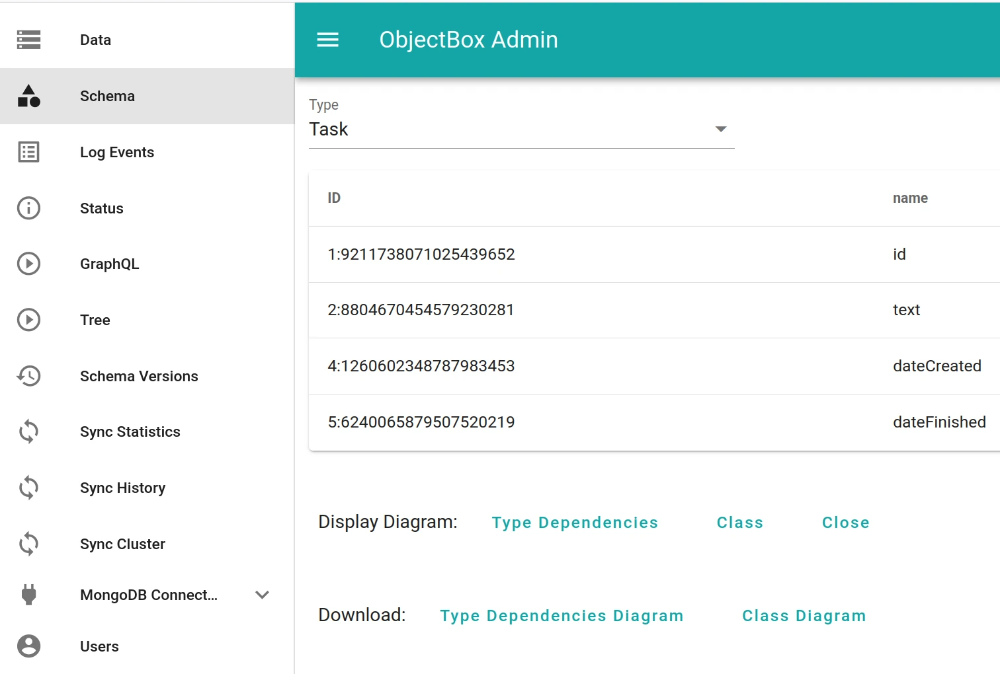
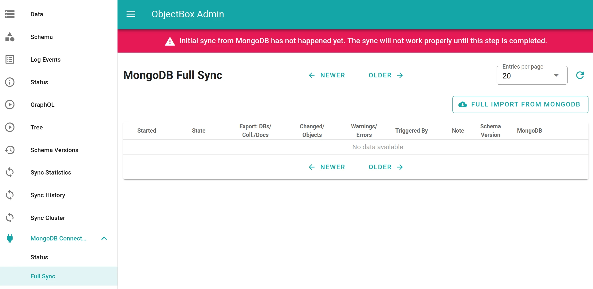
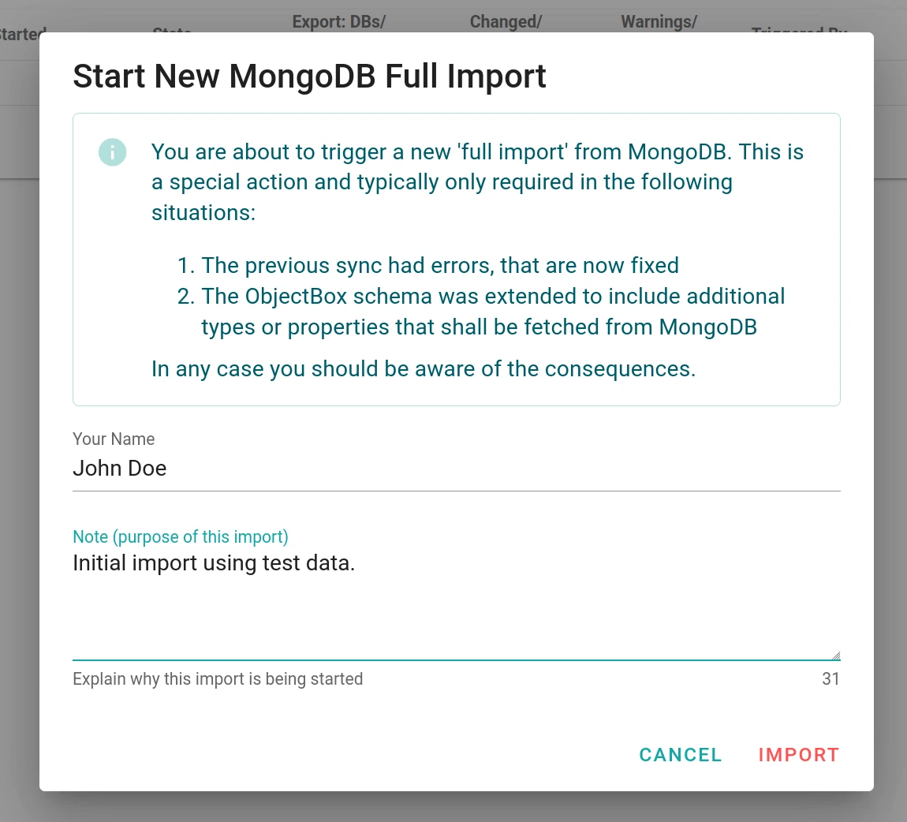
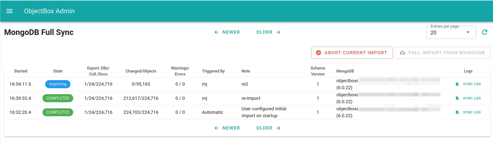
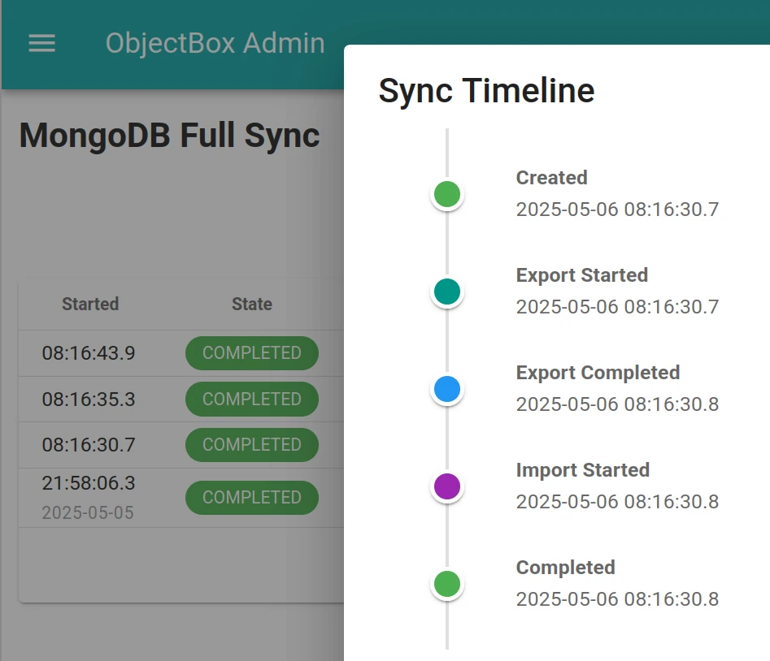

# ObjectBox Sync Connector setup

Once you have a [MongoDB instance running](mongodb-configuration.md), you can connect the ObjectBox Sync Server to it.

## ObjectBox preparations

Before using the MongoDB Sync Connector, let us ensure that the ObjectBox Sync Server is up and running. This involves basically two steps: having a data model and running the ObjectBox Sync Server. Read on for details.

### Create and provide a data model


The ObjectBox data model defines which collections are synced with MongoDB (and much more).


In general, ObjectBox relies on a data model, which is typically defined as part of your (client) application. This is a different approach to MongoDB and other databases. The data model is defined by developers using special annotations in the programming language of your application. If you are not familiar with that process yet, then this is a good time to get familiar with ObjectBox "annotations" and how to define your data model. This is dependent on the programming language:

* [Java, Kotlin, Dart, Python](https://docs.objectbox.io/entity-annotations)
* [Swift](https://swift.objectbox.io/entity-annotations)
* [Go](https://golang.objectbox.io/entity-annotations)
* [C, C++](https://cpp.objectbox.io/entity-annotations) (uses a FlatBuffers schema file)

All ObjectBox build tools also generate a data model JSON file, which must be provided to the ObjectBox Sync Server. This data model is also used by the MongoDB Sync Connector to map data between ObjectBox and MongoDB (see the [data mapping page](mongodb-data-mapping.md)).

### Run and test Sync Server

To avoid any later issues, run and test Sync Server without connecting to MongoDB and your client application, and validate that data is synced.

See the [sync-server](../sync-server/ "mention") page on how to run Sync Server.

By then you should be able to reach the ObjectBox Sync Server [Admin web app](../sync-server/README.md#admin-web-ui). Navigate to the "Schema" page to see your data model, which should look similar to this:

<figure><figcaption><p>Figure 1: Data model (schema), which will be synced with MongoDB</p></figcaption></figure>

For a visual overview, you can also try the "Type dependencies" and "Class" diagrams on the page.

## Configure the MongoDB connection


Use a separate MongoDB instance for testing purposes.


Now that the Sync Server is up and running, let us connect it to MongoDB. This can be done via CLI arguments or via the configuration file. These two settings are essential:

* The **"MongoDB URL"** is the [MongoDB connection string](https://www.mongodb.com/docs/manual/reference/connection-string/) (URL or URI). This can be an empty string for the default `127.0.0.1:27017` host (i.e. a MongoDB instance running locally for development).
* The **"primary MongoDB database name"** is the "database" containing the collections used for sync. By default, this is "objectbox\_sync". This value must not be changed after the full sync with MongoDB was made. See below for more information.

### Configure via CLI arguments

To configure the ObjectBox MongoDB Sync Connector via CLI arguments when starting Sync Server (see [sync-server](../sync-server/ "mention")), you can use the following CLI arguments:

* `--mongo-url`: The MongoDB connection string (URL or URI).
* `--mongo-db`: The primary MongoDB database name.
* `--mongo-initial-import`: Automatically triggers the full sync/import from MongoDB on startup (equivalent to `mongoDb.automaticInitialImport` in the JSON config).


If you are using Docker on Windows/macOS to run an instance of the ObjectBox Sync server, use `host.docker.internal` as the host in the MongoDB connection string for the `--mongo-url` parameter, for example,

```bash
docker run --rm -it \
    --volume "$(pwd):/data" \
    --user $UID \
    --publish 127.0.0.1:9999:9999 \
    --publish 127.0.0.1:9980:9980 \
    objectboxio/sync:sync-server-${sync_server_version} \
    --model /data/objectbox-model.json \
    --unsecured-no-authentication \
    --admin-bind 0.0.0.0:9980 \
    --mongo-url mongodb://host.docker.internal:27017 \
    --mongo-db test-db
```

This enables the Sync server running within the container to access the MongoDB instance running on the host system. Note: **it only works on Windows and macOS**, but not on Linux.


### Configure via configuration file

Alternatively, configure the MongoDB connection in the Sync Server configuration file (see [configuration.md](../sync-server/configuration.md "mention")). In your `sync-server-config.json`, add a new `mongoDb` node which contains key/value pairs for MongoDB specific configuration attributes:

```json
{
    "mongoDb": {
        "url": "mongodb://1.2.3.4:27017",
        "database": "MyDatabase"
    }
}
```

### The primary MongoDB database

At this point, ObjectBox syncs against one "primary MongoDB database name".
It's called the "primary" DB name as ObjectBox will be able to target multiple MongoDB databases in the future.
Reach out to the ObjectBox team if you are interested in this feature.


Do not switch the primary database after the full sync with MongoDB was made.


During development, you may want to "switch" the primary MongoDB database.
In this case, it's recommended to delete the ObjectBox database and do a complete full sync with MongoDB from scratch.
In the future we may provide additional options.

Note that there is no way to **rename** a database inside MongoDB.
Instead, one usually copies a database to a new name and deletes the old one ("dump and restore" is a variation).
This is another case of "switching" the database,
so you also must delete the ObjectBox database and do a complete full sync with MongoDB from scratch.

## All configuration options

While `url` and `database` are the mandatory options (explained in the section above),
the JSON configuration for MongoDB covers additional options.

```json
{
    "mongoDb": {
        "url": "mongodb://1.2.3.4:27017",
        "database": "MyDatabase",
        "automaticInitialImport": true,
        "strictConversionsFromMongoDb": true,
        "strictConversionsToMongoDb": true,
        "emptyListForAbsentValuesFromMongoDb": true      
    }
}
```

Each option explained:

* `automaticInitialImport`: ObjectBox sync with MongoDB usually starts with an initial full sync/import from MongoDB.
  This is usually triggered manually through the Admin UI,
  but setting this flag will trigger the import automatically on startup.
* `emptyListForAbsentValuesFromMongoDb`: For list (vector/array) property types with no value present in MongoDB,
  use empty lists when converting to ObjectBox property values.
  By default, absent values are also absent in ObjectBox typically resulting in null values.
  @note if the value is an explicit null in MongoDB, it will remain null in ObjectBox.
* `strictConversionsFromMongoDb`: Enables strict conversions of data values from MongoDB documents to ObjectBox objects.
  By default, strict mode is off to ensure that convertable data is synced.
  On conversion errors, the sync to ObjectBox will fail without syncing the document.
  This may completely stop the sync from MongoDB to ObjectBox.
  Thus, you should carefully consider the trade-off before enabling this option for production use.
* `strictConversionsToMongoDb`: Enables strict conversions of data values from ObjectBox objects to MongoDB documents.
  By default, strict mode is off to ensure that convertable data is synced.
  On conversion errors, the sync to MongoDB will fail without syncing the object.
  This may completely stop the sync from ObjectBox to MongoDB.
  Thus, you should carefully consider the trade-off before enabling this option for production use.

## Initial import from MongoDB

To fully enable data synchronization, an initial import from MongoDB is necessary. This syncs all collections from MongoDB, which are part of the ObjectBox data model, into ObjectBox. It performs this with snapshot isolation level to offer a maximum level of consistency, e.g. concurrent updates from other systems do not interfere with this process (when done in accordance with MongoDB transaction semantics). From this snapshot onwards, all changes are synchronized continuously between MongoDB and ObjectBox. If one system goes offline, the synchronization will pick up where it left off, so no change will be lost.

When you navigate to a MongoDB page in the Admin UI, you will see a prominent message if the initial import has not run yet:

<figure><figcaption><p>Figure 2: The initial MongoDB import still needs to be triggered</p></figcaption></figure>

## Triggering a full MongoDB import

On the "Full Sync" page beneath the "MongoDB Connector" menu, tap the "Full Import from MongoDB" button and a dialog like this will appear:

<figure><figcaption><p>Figure 3: MongoDB import confirmation dialog</p></figcaption></figure>

It shows you some information and input fields. You must enter your name (required) and optional notes to help you identify this import in the future. Then tap "Import" to start the import process.

During the import you can see the progress on the page. There are two main phases:

* Exporting from MongoDB: one column shows the counts of MongoDB databases, collections and documents already exported.
* Importing into ObjectBox: the next column to the right shows the counts of objects actually changed in ObjectBox and the total count of all checked objects, which should roughly match the number of documents in MongoDB.

<figure><figcaption><p>Figure 4: MongoDB Example of an ongoing import</p></figcaption></figure>

As you can see in the image above, you have the possibility to abort an ongoing import process. This is to be used very cautiously, as it can yield inconsistent states of data if importing has already started (e.g. dangling relations). Then the best course of action is to start a new full sync again and let it complete. Aborting an ongoing import should be reserved for emergencies only.

A finished import will show up as "Completed" in the "State" column on a green background. At that point, it is a good time to check the logs to ensure the sync went smoothly. Also, having a look at the "Data" page will give you a good overview of the data imported.

## Viewing imports

As seen in a previous screenshot above, the "Full Sync" MongoDB page shows a table of all current and past import processes. This history gives you a good overview of what was imported and when. These are the columns:

* Started: when the import started
* State: the current state of the import; it typically goes through these phases: "Started", "Exporting", "Importing", "Completed"
* "Export: DBs/Coll./Docs": the counts of MongoDB databases, collections and documents exported
* "Changed/Objects": the count of objects actually changed in ObjectBox and the total count of all checked objects, which should roughly match the number of documents in MongoDB
* Warnings/Errors: the count of warnings and errors; details can be found in the logs
* Triggered by: the name entered for this import (in the import confirmation dialog)
* Note: the note entered for this import (in the import confirmation dialog)
* Schema Version: The ObjectBox schema version that was current when the import started. The Admin UI has a "Schema Versions" page showing the history of past versions of the data model. Thus, you can track changes to the data model over time.
* MongoDB: the URL and MongoDB version used for this import
* Logs: A link to the log events. Note: a future version will filter the logs for this import.

You can also see the timeline of an import/sync process by clicking on the state. It shows when a new state was reached and should look like this:

<figure><figcaption><p>Figure 5: MongoDB Example Timeline of a completed sync</p></figcaption></figure>

## Troubleshooting

### MongoDB Snapshot Isolation and Timeouts


This section gives some technical details about MongoDB snapshot isolation. You can skip it if your import was completed successfully.


If you run into snapshot errors like "SnapshotTooOld" during an import, this is likely due to a MongoDB setting. In the ObjectBox log, you may see an error message like this:

```
Prefetch failed: Read timestamp Timestamp(1234567890, 1) is older than the oldest available timestamp.: generic server error`
```

What is happening? To read the data from MongoDB, the ObjectBox Sync Connector uses the [snapshot read concern](https://www.mongodb.com/docs/manual/reference/read-concern-snapshot/) to ensure consistent reads at a single point in time (from a strict database perspective). MongoDB keeps snapshots for a limited time, e.g. 5 minutes by default. Thus, if reading the data from MongoDB does not complete within that time, it will fail with a snapshot history error.

This issue typically only starts with MongoDB databases containing at least 10 GB, and depending on the network and MongoDB instance speed, the limit may be much higher. If you run into this error, you may want to increase the snapshot history window.
A MongoDB admin (special elevated permissions are typically needed) can increase the setting [minSnapshotHistoryWindowInSeconds](https://www.mongodb.com/docs/manual/reference/parameters/#mongodb-parameter-param.minSnapshotHistoryWindowInSeconds) to a higher value. The default value is 300 (5 minutes), so adjust it according to your database size and network speed.

_Note:_ with MongoDB Atlas or other cloud providers, setting the `minSnapshotHistoryWindowInSeconds` value may require filing a support ticket. 

### Verify that the MongoDB Atlas cluster is reachable

First, attach to the Docker container as the root user (for details, see [troubleshooting sync](../troubleshooting-sync.md)):

```bash
docker exec -it --user 0 <container-id> /bin/bash
``` 

Then, inside the container run this:

```bash
microdnf install -y bind-utils # needs root
# From your MongoDB connection string, get the cluster address for the next command:
dig +short SRV _mongodb._tcp.<your-cluster-address> 
# This will show multiple host names; pick one host and run:
nc -vz <host> 27017
```
When this succeeds, the output should look something like this:

```
Ncat: Connected to 1.2.3.4:27017.
Ncat: 0 bytes sent, 0 bytes received in 0.05 seconds.
```
