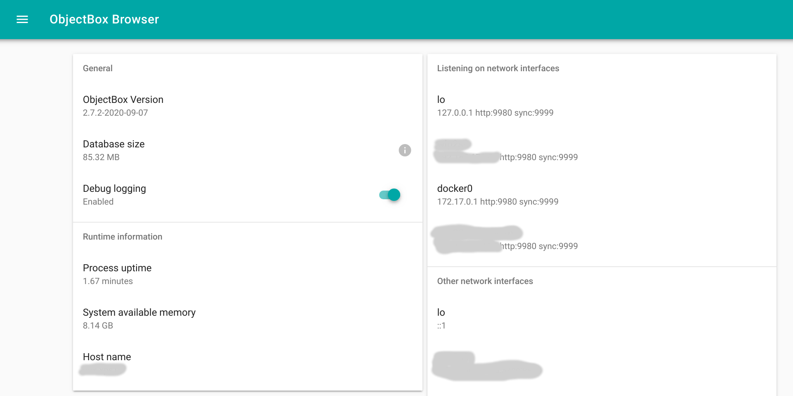

# ObjectBox Sync Server

The ObjectBox Sync Server enables ObjectBox Sync. ObjectBox Sync clients connect to Sync Server to exchange data to update each other (data synchronization). You need to contact the ObjectBox team to get your personal copy of Sync Server (plain executable or Docker). It comes as a single command-line application `sync-server` and includes a web based data browser and management interface for administrator users.&#x20;

## Getting started

To start the server, you need a data model JSON file generated by one of the [ObjectBox Sync clients](sync-client.md).


If you did not define a data model yet, please do so now as [outlined in the client section](sync-client.md#enable-your-objects-for-objectbox-sync).


For the initial setup you must supply the model file (and an authentication option):

```
$ ./sync-server --model=objectbox-model.json --unsecured-no-authentication
001-13:09:15.6995 [INFO ] [SySvAp] Default configuration file sync-server-config.js not found
001-13:09:15.6996 [INFO ] [SvrMsg] Registering server transport for ws
001-13:09:15.6997 [INFO ] [SySvAp] Database has no schema, loading from objectbox-model.json
001-13:09:15.6998 [INFO ] [SySvAp] Model file objectbox-model.json loaded, it has 2563 bytes
001-13:09:15.6999 [INFO ] [SchVer] Inserted new schema version ID 1
001-13:09:15.6999 [INFO ] [SySvAp] Switching schema version ID to 1
001-13:09:15.7002 [INFO ] [SchVer] Update schema version ID 1: acceptClients := true
001-13:09:15.7012 [INFO ] [SySvAp] Starting the server with a schema version ID 1
001-13:09:15.7018 [INFO ] [SvrUws] UwsServer listening on all interfaces, port 9999 without SSL
001-13:09:15.7018 [WARN ] [SvSync] INSECURE no-authentication mode enabled - every client allowed without any validation
001-13:09:15.7019 [INFO ] [SvSync] Started on port 9999
001-13:09:15.7019 [INFO ] [SySvAp] Starting object browser on http://127.0.0.1:9980
001-13:09:15.7020 [INFO ] [HttpSv] Running in single-store mode with an already opened store
001-13:09:15.7020 [INFO ] [HttpSv] Listening on http://127.0.0.1:9980
001-13:09:15.7020 [INFO ] [HttpSv] User management: enabled
001-13:09:15.7021 [INFO ] [SySvAp] ObjectBox sync server started in 2.63 ms
```


During development on your private network, you can disable authentication altogether using the option `--unsecured-no-authentication`. This allows all clients, which know the server's URL, to connect without additional checks.

_Warning:_ it should be obvious that this setting is not intended for production usage.


As of now, the server is already running and accessible:

* ObjectBox Sync on all interfaces, port 9999:\
  Use this information (using a reachable IP or host name) to setup Sync clients
* Admin web UI on localhost, port 9980:\
  Have a look [http://127.0.0.1:9980](http://127.0.0.1:9980) in your favorite web browser.

### Docker

ObjectBox Sync Server is also available as a docker image (e.g. to run on Windows). It is not available to public, so ensure to contact us so we can set up individual access for you. We have two models for Docker images: image files or private repository on Docker Hub.

#### Docker image file distribution

If we sent you a Docker image for download (e.g. via a [Sync trial](https://objectbox.io/sync/)), you can import it with Docker's [load](https://docs.docker.com/engine/reference/commandline/load/) command:

```bash
$ docker load --input ~/Downloads/sync-server.tar
c7022781a1ed: Loading layer [================================>]  13.55MB/13.55MB
53308e59a2cf: Loading layer [================================>]  1.536kB/1.536kB
Loaded image: objectboxio/sync:21.3.1-server
```

#### Pull image from Docker Hub

If we send you information for a private Docker Hub repository, please ensure that you are logged in using the Docker login that was agreed on using `docker login`. Then, you can pull the image using `docker pull objectboxio/sync-<customer>:sync-server-<version>`; with replacing the placeholders \<customer> and \<version> with actual values (we provide that information to you).

#### Run a Docker container

Once the image is imported or pulled, you can [run](https://docs.docker.com/engine/reference/commandline/run/) the container. The following example starts Sync Server using the current directory as the data folder and exposes the sync-server on localhost:9999 and admin web UI on [http://localhost:9980](http://localhost:9980). Ensure to have the file objectbox-model.json in the current directory on your host (it's mapped to /data inside the container):


Note: the following command assumes objectbox-model.json is in the current directory.

The database will be stored in the current directory's "objectbox" subdirectory



The Docker image name "objectboxio/sync:sync-server-2023-01-19" is an example that must be adjusted to the name that you actually got from us.




```bash
docker run --rm -it \
    --volume "$(pwd):/data" \
    --publish 127.0.0.1:9999:9999 \
    --publish 127.0.0.1:9980:9980 \
    --user $UID \
    objectboxio/sync:sync-server-2023-01-19 \
    --model /data/objectbox-model.json \
    --unsecured-no-authentication \
    --admin-bind 0.0.0.0:9980
```



#### Using Docker volumes for database files

Alternatively, you could keep data in a separate docker volume. This example shows how to create the volume for the first time and then how to use it to start the Sync Server container (note: the difference to the previous example is in `--mount` and `--user` arguments).&#x20;



```bash
# You only need to create the volume once:
docker volume create sync-server-data

# To copy the objectbox-model.json file to the volume, map
# the volume to the current directory. 
# Then use the busybox image to copy the file:
docker run --rm --volume "$(pwd):/src" --volume sync-server-data:/data busybox \
    cp /src/objectbox-model.json /data/

# To start the server, similarly to the example above:
docker run --rm -it \
    --mount source=sync-server-data,target=/data \
    --publish 127.0.0.1:9999:9999 \
    --publish 127.0.0.1:9980:9980 \
    objectboxio/sync:sync-server-2023-01-19 \
    --model /data/objectbox-model.json \
    --unsecured-no-authentication \
    --admin-bind 0.0.0.0:9980
```



```powershell
# You only need to create the volume once:
docker volume create sync-server-data

# To copy the objectbox-model.json file to the volume, map
# the volume to the current directory. 
# Then use the busybox image to copy the file:
docker run --rm --volume ${PWD}:/src --volume sync-server-data:/data busybox `
    cp /src/objectbox-model.json /data/

# To start the server, similarly to the example above:
docker run --rm -it `
    --mount source=sync-server-data,target=/data `
    --publish 127.0.0.1:9999:9999 `
    --publish 127.0.0.1:9980:9980 `
    objectboxio/sync:21.3.1-server `
    --model /data/objectbox-model.json `
    --unsecured-no-authentication `
    --browser-bind 0.0.0.0:9980
```




If you're running on Windows, you may run into permission issues, with the server unable to create a database directory /data/objectbox. In that case, you can either create the directory with the right permissions (again, using `busybox`) or pass`--user=0` argument to docker run (similar to `--user $UID` in the first example) - to run the sync-server as a root user (only applies inside the container).


#### Docker on Windows

When using Docker on Windows, this guide expects you to use [Docker Desktop for WSL 2](https://docs.docker.com/docker-for-windows/wsl/). Check the [Install Docker Desktop on Windows instructions](https://docs.docker.com/desktop/install/windows-install/) if you don't have it installed yet.

To follow the best practices and achieve optimal performance, as described by [Microsoft](https://docs.microsoft.com/en-us/windows/wsl/compare-versions#performance-across-os-file-systems) and [Docker](https://docs.docker.com/docker-for-windows/wsl/#best-practices), use a data volume for the database directory instead of binding to a local directory. Follow [#using-docker-volumes-for-database-files](objectbox-sync-server.md#using-docker-volumes-for-database-files "mention") to do that.&#x20;


If you're using PowerShell, make sure to use `${PWD}` instead of `$(pwd)` and replace the backward slash (\\) for multiline commands with a backtick (\`).


## Configuration

The setup options for ObjectBox Sync Server are detailed on the [configuration](sync-server-configuration.md) page. In summary,  you can use command line options (e.g. run `sync-server --help` for a quick overview), or use a JSON configuration file for more complex setups. Again, please check the [configuration](sync-server-configuration.md) page for details.&#x20;

## Admin Web UI

The ObjectBox Sync Server Admin UI runs as part of the sync-server executable and allows you to:

* view the data and download it in JSON format,
* view current schema information and previous schema versions,
* view runtime information, like version number, database size, network interfaces, ...
* manage Admin UI user credentials

### Sync Stats

**"**Sync" main menu item will bring you to a page with numerous charts with server runtime information. This can be valuable in multiple ways, e.g. during development, you can verify your applications connect to the server (show up in "Connects" and "Connected clients") and synchronize data (see "Client applied \*"). Also, there are multiple charts showing errors - watch for those when trying to figure out issues with your clients.

### Status

In the main menu, you will find "Status" to open a page with some useful information. While the following layout is still not final, it will give you a first impression of what to expect:



The "Debug logging" switch on the status page enables a very detailed logging (to standard output).

## Logging

By default only logs with "info" level and above are enabled, which are relatively rare. For example, there's nothing logged about standard interactions with clients. That might be overwhelming with a few hundred clients already. Info logs should never "spam" you, no matter how many clients are connected.

Let's look at a typical log during startup:

```
001-14:09:07.5792 [INFO ] [SySvAp] Default configuration file sync-server-config.js not found
001-14:09:07.5793 [INFO ] [SvrMsg] Registering server transport for ws
001-14:09:07.5831 [INFO ] [SvrUws] UwsServer listening on all interfaces, port 9999 without SSL
001-14:09:07.5832 [WARN ] [SvSync] INSECURE no-authentication mode enabled - every client allowed without any validation
001-14:09:07.5883 [INFO ] [SvSync] Started on port 9999
001-14:09:07.5884 [INFO ] [SySvAp] Starting object browser on 0.0.0.0:9980
001-14:09:07.5885 [INFO ] [HttpSv] Running in single-store mode with an already opened store
001-14:09:07.5885 [INFO ] [HttpSv] Listening on 0.0.0.0:9980
001-14:09:07.5885 [INFO ] [HttpSv] User management: enabled
001-14:09:07.5890 [INFO ] [SySvAp] ObjectBox sync server started in 10 ms
```

As you can see, logging is structured into the following columns:

* **Thread:** the first three digits are the number of the thread that logged the text message
* **Time:** UTC time using 24 hours format, including 1/10,000 second precision (1/10 milliseconds)
* **Level:** One of the log levels (listed with increasing severity):
  * DEBUG: extensive logs to help diagnosing a specific behavior. If you want to use debug logs, compile with the "DebugLog" freature flag and enable them within your app (e.g. use debugLog(true) in C++).
  * INFO: "important" information
  * WARN: something unusual has happened that you might want to check.
  * ERROR: reserved for special error occasions ("something bad happened") that typically require some action. It might be that the machine is running out of resources (RAM, disk space etc) or an unexpected situation was encountered. When in doubt, reach out to the ObjectBox team to clarify what's going on.
* **Tag (optional):** Most logs include a tag identifying the internal component
* **Message:** the actual log text

After startup, you typically won't see anymore logs by default. In contrast to "info" and above, "debug" level logs gives you extensive information including client connects and message interactions with clients.

To give you a feel what debug logs are like have a look at the following example. It shows a new client connecting, logging in and sending data:

```
014-15:25:18.3188 [DEBUG] [SvrUws] (#1) Connection from 127.0.0.1:50488
014-15:25:18.3194 [DEBUG] [SvSync] (#1) Got msg of type LOGIN and length 28
014-15:25:18.3195 [DEBUG] [W-Pool] "SrvRead" Submitted new job successfully
002-15:25:18.3195 [DEBUG] [SvLgIn] (D10F) Authenticator 0 welcomes a new client
002-15:25:18.3195 [DEBUG] [W-Pool] "SrvRead" W#1 finished job in 0.06 ms
014-15:25:18.3195 [DEBUG] [SvrUws] Popped 1 messages to send
014-15:25:18.3207 [DEBUG] [SvSync] (D10F) Got msg of type APPLY_TX and length 140
014-15:25:18.3207 [DEBUG] [W-Pool] "SrvWrite" Submitted new job successfully
012-15:25:18.3215 [DEBUG] [TxLogA] Applied 4 commands
012-15:25:18.3277 [DEBUG] TX #5492 committed
009-15:25:18.3277 [DEBUG] [SvLogM] Applied TX log from D10FDB04A0F0: base=5460B3A444C2CD5377EAE8FBFFAC6B12, old=9A37C8BCA4232AA2D6E502AE2D069C15, new=4B2D216711C60497088B5FB10816CC98
009-15:25:18.3277 [DEBUG] [SvApTx] (D10F) Sending ACK_TX #1: 5460B3A4
009-15:25:18.3277 [DEBUG] [W-Pool] "SrvWrite" W#1 finished job in 7.01 ms
013-15:25:18.3278 [DEBUG] [SvDPsh] Have 116 bytes of data (0 clients).
014-15:25:18.3278 [DEBUG] [SvrUws] Popped 1 messages to send
```

## Setting the Authentication method

If the server is run without specifying an authentication method for clients, it won't start:

```
$ ./sync-server --model=objectbox-model.json
...
001-13:05:07.3526 [ERROR] [SySvAp] Runtime error: Authenticator must be set before starting
001-13:05:07.4524 [INFO ] [SvSync] Stopped (port 0)
Authenticator must be set before starting
```

To specify an authentication method for clients provide a [configuration file](objectbox-sync-server.md#configuration).


During development, it's also possible to use the `--unsecured-no-authentication` flag to allow any connection from any client.

Never use this option in an app shipped to customers. It is inherently insecure and allows anyone to connect to the sync server.


## Updating the data model

The model JSON is used to initialize the database schema and can also be used later to switch the schema to a newer version, by starting the server with an updated model file. Alternatively, the schema version can be changed through the web UI.

## Feedback

While we hope that ObjectBox Sync is already useful for your use case, we're also aware that some features are missing. We're looking forward to your feedback to prioritize the most requested features. Please fill in this [Sync Feedback Form](https://forms.gle/JtUDBo61UQTExRao8) to tell us what you think.

Please let the ObjectBox team know if you run into issues; we're happy to help. We are aware of rough edges still exist and might be able to help you one way or the other. Feel free to send us a message on contact\[at]objectbox.io.

Thank you!
