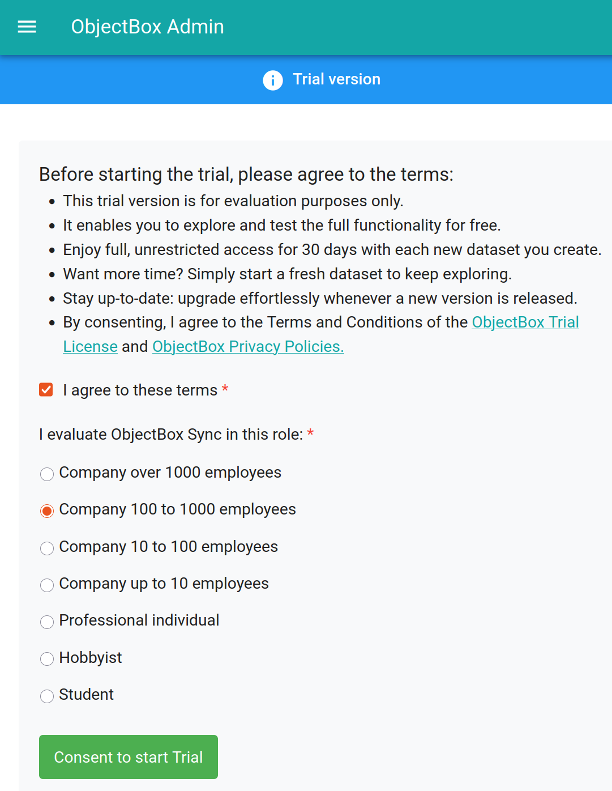
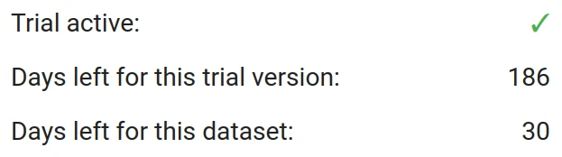
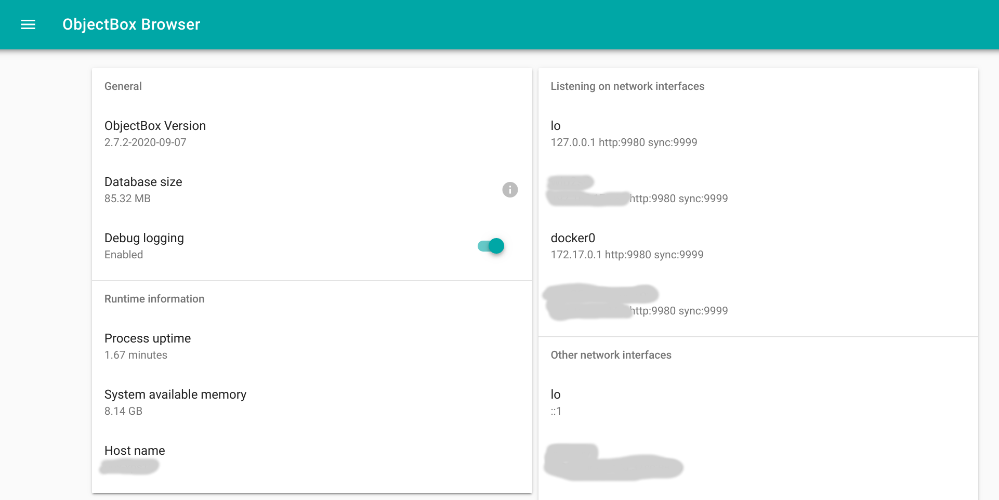

# Sync Server

The ObjectBox Sync Server is the centerpiece of ObjectBox Sync. It lets ObjectBox Sync clients connect for data exchange (data synchronization).

ObjectBox Sync Server is a very efficient making it usable on a wide range of devices. By itself, it needs only a few MB RAM and disk space. It even runs on small devices, like a Raspberry Pi and mobile phones. Nevertheless, it seamlessly scales to the cloud serving millions of clients when set up as a cluster.

## Get the Sync Server


Starting from late May 2025, ObjectBox Sync Server trials are publicly available as Docker images. :tada:


To test the Sync Server with your data, ObjectBox offers a free trial. It comes as a publicly available Docker image, which you can pull from [our Docker Hub](https://hub.docker.com/r/objectboxio/sync-server-trial/):

```shell
docker pull objectboxio/sync-server-trial
```


**New to Docker?** Check these guides:

* [Get Docker](https://docs.docker.com/get-started/get-docker/)
* [What is Docker?](https://docs.docker.com/get-started/docker-overview/)
* [What is a container?](https://docs.docker.com/get-started/docker-concepts/the-basics/what-is-a-container/)
* [What is an image?](https://docs.docker.com/get-started/docker-concepts/the-basics/what-is-an-image/)

Ensure that running `docker run hello-world` works before you continue with the Sync server.


For a fully operational Sync Server, you need to start it with a **data model file** (see below). But to quickly verify that it is starting up fine, you can use the following command to make it print its version and exit:

```shell
docker run --rm -it objectboxio/sync-server-trial --version
```

OK, now let's see how get the data model file...

## Data model JSON file


Prefer to start with a ready-to-use example? Check out [our Sync Examples repository](https://github.com/objectbox/objectbox-sync-examples).


To start the server, you need to pass your data model, which describes the structure of your data. It is JSON file generated by one of the [ObjectBox Sync clients](../sync-client.md) and is required to initialize the ObjectBox Server database.

If you did not define a data model yet, then now is the time to do so. Basically, you need to start this on the **client side** by defining your data types in the programming language of your choice. Then, the **ObjectBox tooling will generate the data model file**. This is a standard process even for the non-sync ObjectBox database. So it's a good idea to look at the [ObjectBox database docs](https://docs.objectbox.io) and especially at the [Entity annotations](https://docs.objectbox.io/entity-annotations) that tag your data classes (e.g. `@Entity`). Data types that shall be synced via ObjectBox Sync also need to be tagged accordingly (e.g. `@Sync`). This is [outlined in the client section](../sync-client.md#enable-your-objects-for-objectbox-sync).


Keep your data model file safe and secure. It contains the schema of your data model along with **unique IDs which cannot be restored**. If you lose it, you will lose access to your data and synchronization. Thus, **always** check the JSON file into your version control system, e.g. git.


## Run the Docker container

Once the image is pulled, you can [run](Once the image is pulled, you can [run](https://docs.docker.com/reference/cli/docker/container/run/) the container. The following example starts Sync Server using the current directory as the data folder and exposes the sync-server on localhost:9999 and admin web UI on [http://localhost:9980](http://localhost:9980). Ensure to have the file objectbox-model.json in the current directory on your host (it's mapped to /data inside the container):


Note: the following command assumes objectbox-model.json is in the current directory.

The database will be stored in the current directory's "objectbox" subdirectory




```bash
docker run --rm -it \
    --volume "$(pwd):/data" \
    --publish 127.0.0.1:9999:9999 \
    --publish 127.0.0.1:9980:9980 \
    --user $UID \
    objectboxio/sync-server-trial \
    --model /data/objectbox-model.json \
    --unsecured-no-authentication \
    --admin-bind 0.0.0.0:9980
```


```powershell
docker run --rm -it ^
    --volume "%cd%:/data" ^
    --publish 127.0.0.1:9999:9999 ^
    --publish 127.0.0.1:9980:9980 ^
    objectboxio/sync-server-trial ^
    --model /data/objectbox-model.json ^
    --unsecured-no-authentication ^
    --admin-bind 0.0.0.0:9980
```



Now the server should be running and accessible:

* ObjectBox Sync on all interfaces, port 9999:\
  Use this information (using a reachable IP or host name) to setup Sync clients
* Admin web UI on localhost, port 9980:\
  Have a look at [http://127.0.0.1:9980](http://127.0.0.1:9980) in your web browser.

If you run into any problems, please check the [troubleshooting guide](../troubleshooting.md).

## Activating the trial

Once the ObjectBox Sync Server is started, open the Admin web UI at [http://127.0.0.1:9980](http://127.0.0.1:9980) and you should be taken to the [Sync Trial](http://localhost:9980/#/sync-trial) page. It shows the conditions for the trial version, e.g. that you have a testing period of 30 days **per dataset**. After you consent, you are forwarded to log in with your ObjectBox user account. If you don't have an account yet, you can register using email/password, a GitHub or a Google account.  

<figure><figcaption><p>ObjectBox Sync Trial</p></figcaption></figure>

Once consented, the Sync Trial page displays trial status, which should look like this:


You have plenty of time to explore ObjectBox Sync. You can always restart the trial after expires:

* If the "trial version" expired, it is a sign that the software is out of date. Renew the Docker image by pulling (`docker pull objectboxio/sync-server-trial`).
* If the dataset expired, create a new dataset. Start with a fresh database, e.g. by using another mount for the data folder. Alternatively, delete the database folder, which is typically called "objectbox" and contains a data.mdb file. Making a backup of the folder first is recommended.

## Configuration

The setup options for ObjectBox Sync Server are detailed on the [configuration](configuration.md) page. In summary, you can use command line options (e.g. run `sync-server --help` for a quick overview), or use a JSON configuration file for more complex setups. Again, please check the [configuration](configuration.md) page for details.

## Admin Web UI

The ObjectBox Sync Server Admin UI runs as part of the sync-server executable and allows you to:

* view the data and download it in JSON format,
* view current schema information and previous schema versions,
* view runtime information, like version number, database size, network interfaces, ...
* manage Admin UI user credentials

### Sync Stats

\*\*"\*\*Sync" main menu item will bring you to a page with numerous charts with server runtime information. This can be valuable in multiple ways, e.g. during development, you can verify your applications connect to the server (show up in "Connects" and "Connected clients") and synchronize data (see "Client applied \*"). Also, there are multiple charts showing errors - watch for those when trying to figure out issues with your clients.

### Status

In the main menu, you will find "Status" to open a page with some useful information. While the following layout is still not final, it will give you a first impression of what to expect:



The "Debug logging" switch on the status page enables a very detailed logging (to standard output).

## Logging

By default only logs with "info" level and above are enabled, which are relatively rare. For example, there's nothing logged about standard interactions with clients. That might be overwhelming with a few hundred clients already. Info logs should never "spam" you, no matter how many clients are connected.

Let's look at a typical log during startup:

```
001-14:09:07.5792 [INFO ] [SySvAp] Default configuration file sync-server-config.js not found
001-14:09:07.5793 [INFO ] [SvrMsg] Registering server transport for ws
001-14:09:07.5831 [INFO ] [SvrUws] UwsServer listening on all interfaces, port 9999 without SSL
001-14:09:07.5832 [WARN ] [SvSync] INSECURE no-authentication mode enabled - every client allowed without any validation
001-14:09:07.5883 [INFO ] [SvSync] Started on port 9999
001-14:09:07.5884 [INFO ] [SySvAp] Starting object browser on 0.0.0.0:9980
001-14:09:07.5885 [INFO ] [HttpSv] Running in single-store mode with an already opened store
001-14:09:07.5885 [INFO ] [HttpSv] Listening on 0.0.0.0:9980
001-14:09:07.5885 [INFO ] [HttpSv] User management: enabled
001-14:09:07.5890 [INFO ] [SySvAp] ObjectBox sync server started in 10 ms
```

As you can see, logging is structured into columns:

* **Thread:** the first three digits are the number of the thread that logged the text message
* **Time:** UTC time using 24 hours format, including 1/10,000 second precision (1/10 milliseconds)
* **Level:** One of the log levels (listed with increasing severity):
  * **DEBUG**: extensive logs to help diagnosing a specific behavior. Debug logs are only enabled if the DebugLog feature flag is on (usually the Sync Server ships such feature). You also need to make sure the Debug logging switch is enabled on Admin UI (see the screenshot above).
  * **INFO**: "important" information
  * **WARN**: something unusual has happened that you might want to check.
  * **ERROR**: reserved for special error occasions ("something bad happened") that typically require some action. It might be that the machine is running out of resources (RAM, disk space etc) or an unexpected situation was encountered. When in doubt, reach out to the ObjectBox team to clarify what's going on.
* **Tag (optional):** Most logs include a tag identifying the internal component
* **Message:** the actual log text

After startup, you typically won't see anymore logs by default. In contrast to "info" and above, "debug" level logs give you extensive information including client connects and message interactions with clients.

To give you a feel what debug logs are like have a look at the following example. It shows a new client connecting, logging in and sending data:

```
014-15:25:18.3188 [DEBUG] [SvrUws] (#1) Connection from 127.0.0.1:50488
014-15:25:18.3194 [DEBUG] [SvSync] (#1) Got msg of type LOGIN and length 28
014-15:25:18.3195 [DEBUG] [W-Pool] "SrvRead" Submitted new job successfully
002-15:25:18.3195 [DEBUG] [SvLgIn] (D10F) Authenticator 0 welcomes a new client
002-15:25:18.3195 [DEBUG] [W-Pool] "SrvRead" W#1 finished job in 0.06 ms
014-15:25:18.3195 [DEBUG] [SvrUws] Popped 1 messages to send
014-15:25:18.3207 [DEBUG] [SvSync] (D10F) Got msg of type APPLY_TX and length 140
014-15:25:18.3207 [DEBUG] [W-Pool] "SrvWrite" Submitted new job successfully
012-15:25:18.3215 [DEBUG] [TxLogA] Applied 4 commands
012-15:25:18.3277 [DEBUG] TX #5492 committed
009-15:25:18.3277 [DEBUG] [SvLogM] Applied TX log from D10FDB04A0F0: base=5460B3A444C2CD5377EAE8FBFFAC6B12, old=9A37C8BCA4232AA2D6E502AE2D069C15, new=4B2D216711C60497088B5FB10816CC98
009-15:25:18.3277 [DEBUG] [SvApTx] (D10F) Sending ACK_TX #1: 5460B3A4
009-15:25:18.3277 [DEBUG] [W-Pool] "SrvWrite" W#1 finished job in 7.01 ms
013-15:25:18.3278 [DEBUG] [SvDPsh] Have 116 bytes of data (0 clients).
014-15:25:18.3278 [DEBUG] [SvrUws] Popped 1 messages to send
```

## Updating the data model

The model JSON is used to initialize the data model for sync (and also the database schema). Later, when your data model has evolved, you will want to update model at server. You have two options to supply a newer version:

* Starting the server with an updated model file.
* Upload the model file through the Admin web UI.

For details, please refer to the [data model evolution](../data-model/) section.

## Feedback

We're looking forward to your feedback to prioritize the most requested features. Please fill in this [Sync Feedback Form](https://forms.gle/JtUDBo61UQTExRao8) to tell us what you think.

And if you run into issues, please let the ObjectBox team know; we're happy to help.

Thank you!

## Appendix

### Using Docker volumes for database files

Alternatively, you could keep data in a separate docker volume. This example shows how to create the volume for the first time and then how to use it to start the Sync Server container (note: the difference to the previous example is in `--mount` and `--user` arguments).



```bash
# You only need to create the volume once:
docker volume create sync-server-data

# To copy the objectbox-model.json file to the volume, map
# the volume to the current directory. 
# Then use the busybox image to copy the file:
docker run --rm --volume "$(pwd):/src" --volume sync-server-data:/data busybox \
    cp /src/objectbox-model.json /data/

# To start the server, similarly to the example above:
docker run --rm -it \
    --mount source=sync-server-data,target=/data \
    --publish 127.0.0.1:9999:9999 \
    --publish 127.0.0.1:9980:9980 \
    objectboxio/sync-server-trial \
    --model /data/objectbox-model.json \
    --unsecured-no-authentication \
    --admin-bind 0.0.0.0:9980
```



```powershell
# You only need to create the volume once:
docker volume create sync-server-data

# To copy the objectbox-model.json file to the volume, map
# the volume to the current directory. 
# Then use the busybox image to copy the file:
docker run --rm --volume ${PWD}:/src --volume sync-server-data:/data busybox `
    cp /src/objectbox-model.json /data/

# To start the server, similarly to the example above:
docker run --rm -it `
    --mount source=sync-server-data,target=/data `
    --publish 127.0.0.1:9999:9999 `
    --publish 127.0.0.1:9980:9980 `
    objectboxio/sync-server-trial `
    --model /data/objectbox-model.json `
    --unsecured-no-authentication `
    --admin-bind 0.0.0.0:9980
```




If you're running on Windows, you may run into permission issues, with the server unable to create a database directory /data/objectbox. In that case, you can either create the directory with the right permissions (again, using `busybox`) or pass`--user=0` argument to docker run (similar to `--user $UID` in the first example) - to run the sync-server as a root user (only applies inside the container).


### Docker on Windows

When using Docker on Windows, this guide expects you to use [Docker Desktop for WSL 2](https://docs.docker.com/docker-for-windows/wsl/). Check the [Install Docker Desktop on Windows instructions](https://docs.docker.com/desktop/install/windows-install/) if you don't have it installed yet.

To follow the best practices and achieve optimal performance, as described by [Microsoft](https://docs.microsoft.com/en-us/windows/wsl/compare-versions#performance-across-os-file-systems) and [Docker](https://docs.docker.com/docker-for-windows/wsl/#best-practices), use a data volume for the database directory instead of binding to a local directory. Follow [#using-docker-volumes-for-database-files](./#using-docker-volumes-for-database-files "mention") to do that.


If you're using PowerShell, make sure to use `${PWD}` instead of `$(pwd)` and replace the backward slash (\\) for multiline commands with a backtick (\`).
