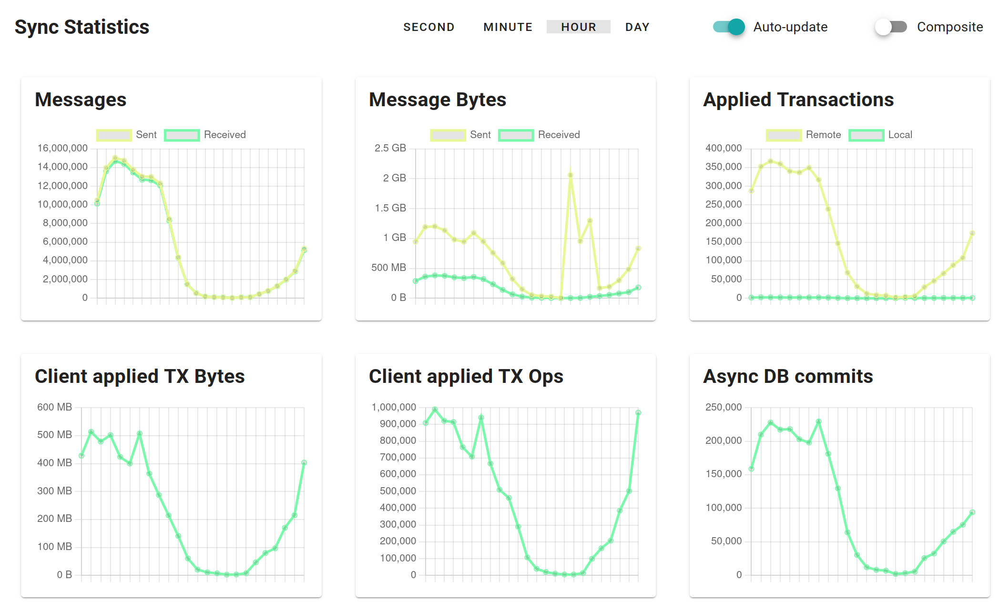
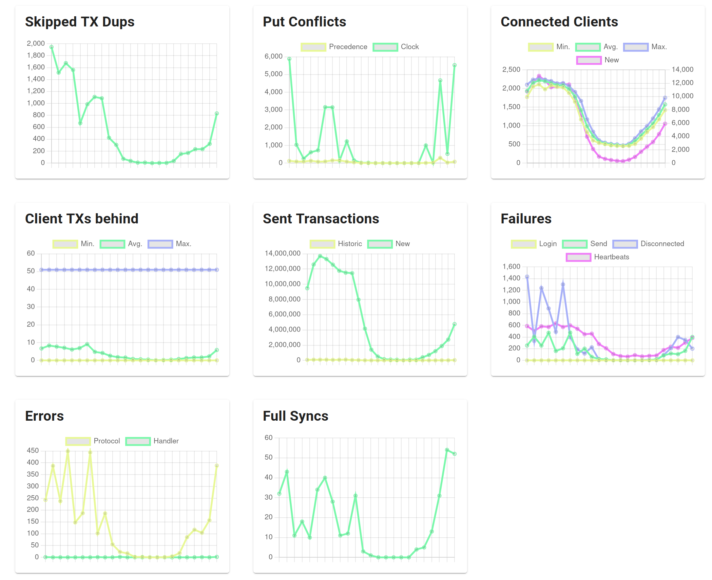

# Sync Statistics

The Sync Statistics page of the Admin web UI shows charts with runtime information of the Sync Server:
connected clients, messages, transactions applied and sent, failures, and errors.
Open it via "Sync Statistics" in the menu on the left.

Use the charts during development to verify that your apps connect to the server and synchronize data,
and in production to keep an eye on load, client activity, and errors.
If you use the MongoDB Sync Connector, the data flow between ObjectBox and MongoDB has its own charts;
see [MongoDB Statistics](../../mongodb-sync-connector/mongodb-statistics.md).

<figure><figcaption>
Sync Statistics: messages and transactions
</figcaption></figure>

## Using the charts

At the top of the page, select the time resolution of the charts: "Second", "Minute", "Hour", or "Day".
Each data point covers one interval, e.g. a data point of the "Hour" charts sums up the counts of one hour.
The server keeps the last 60 seconds, 60 minutes, 24 hours, and 30 days in memory;
thus, the statistics start from scratch when the server restarts.

With "Auto-update" enabled, the page polls the server every second while the browser tab is visible;
a new data point appears as soon as an interval of the selected resolution is complete,
e.g. every minute in the "Minute" charts.
Turn it off to freeze the charts, e.g. to have a closer look at a peak.

Most charts count events per interval.
Charts showing a current value, like "Connected Clients", show the value itself in the "Second" charts,
and the minimum, average, and maximum within each interval in the other resolutions.
Charts showing bytes automatically scale to KB, MB, or GB.

The "Composite" switch replaces the individual charts with three combined charts:
"Transactions", "Communication", and "Errors".
Each of them shows several related series in one chart,
which is handy to spot correlations at a glance, e.g. between connects, messages, and connected clients.
Like "Auto-update", the switch is remembered by the browser.

## Messages and transactions

### Messages

Sync protocol messages sent to and received from clients.
This includes all message types, e.g. logins, heartbeats, transactions, and acknowledgments.
For a server in a [Sync Cluster](../sync-cluster.md), messages exchanged with the cluster peers are included as well.

### Message Bytes

The size of the messages sent and received.
The values are measured at the application level,
so they may differ slightly from network-level numbers, e.g. in timing.

### Applied Transactions

Transactions applied to the server database:

* **Remote**: transactions received from Sync clients.
* **Local**: transactions written on the server itself, i.e. not by Sync clients:
  e.g. by the MongoDB Sync Connector, by GraphQL mutations,
  or by an app embedding the Sync Server.

Both kinds of transactions are added to the sync history and pushed to the clients (see "Sent Transactions").

### Client applied TX Bytes

The size of the transactions received from Sync clients and applied to the server database.
Together with "Client applied TX Ops", this shows how much data your clients send.

### Client applied TX Ops

The number of operations, e.g. puts and removes, inside the client transactions applied to the server database.
E.g. a client transaction putting 100 objects counts as one transaction and 100 operations.

### Async DB commits

Database commits done by the asynchronous transaction in the background.

## Conflicts, clients, and errors

<figure><figcaption>
Sync Statistics: conflicts, clients, failures, and errors
</figcaption></figure>

### Skipped TX Dups

Transactions received from clients that were skipped because they were already applied before.
E.g. after a reconnect, a client may send a transaction again if the acknowledgment did not reach it;
the server recognizes and skips the duplicate.
Small numbers are normal, e.g. with clients on unstable connections.

### Put Conflicts

Puts rejected by the server's conflict resolution because the existing object won:

* **Precedence**: the existing object had a higher sync precedence.
* **Clock**: the existing object had a newer or equal sync clock (if precedence is used too, at equal precedence).

This applies to all puts applied at the server:
from Sync clients, from the MongoDB Sync Connector, and local writes.
Puts are only rejected for types that define a sync precedence or sync clock property;
see [Syncing Concurrent Changes](../../syncing-concurrent-changes.md).

### Connected Clients

The number of currently connected clients:
the "Second"-time-interval charts show the current value,
the other resolutions show the minimum, average, and maximum within each interval.
"New" (right axis) counts the connections established within the interval, i.e. before the login.

Use this chart to verify that your apps reach the server.
A high number of new connections compared to the connected clients indicates clients that reconnect frequently,
e.g. because of network issues or failed logins (see "Failures").

### Connected Peers

Only shown for a server in a [Sync Cluster](../sync-cluster.md):
the number of currently connected cluster peers, with minimum, average, and maximum like "Connected Clients".

### Client TXs behind

How far the connected clients lag behind the sync history of the server:
the number of transactions the server has not yet sent to a client.
The values are collected once per second across all connected clients;
the charts show the minimum, average, and maximum.
Note that the server checks the last 50 transactions only; thus, the value is capped at 50.

In normal operation, the average stays close to zero, as new transactions are pushed to connected clients right away.
A client that is far behind, e.g. right after reconnecting, shows up in the maximum until it caught up.

### Sent Transactions

Transactions sent to clients as update messages:

* **Historic**: transactions from the sync history sent to clients that need to catch up, e.g. after (re)connecting.
* **New**: new transactions pushed to connected, up-to-date clients right after they were applied on the server.

The values count per client: a transaction pushed to 1,000 connected clients counts 1,000 times.
Thus, this number is typically much higher than "Applied Transactions".
Transactions filtered out by [sync filters](../sync-filters.md) are not counted.

### Failures

Failures related to clients:

* **Login**: general login failures.
  Failures due to bad credentials, missing permissions, or an unavailable authentication component
  are counted separately and available via the [Prometheus metrics](../monitoring.md) only.
* **Send**: errors while sending messages to clients.
* **Disconnected**: processing was aborted because the client disconnected in the meantime, e.g. during a full sync.
* **Heartbeats**: clients disconnected by the server because their heartbeats stopped,
  e.g. due to a lost network connection.

### Errors

Server-side errors:

* **Protocol**: protocol violations by clients,
  e.g. malformed messages, unknown message types, or messages sent before the login.
  The server closes the connection to the offending client.
* **Handler**: errors while handling messages, i.e. exceptions inside the server's message handlers.

Check the [log events](log-events.md) for details on errors.

### Full Syncs

Full sync messages sent to clients.
A full sync sends all data (within the client's sync filters) to a client instead of individual transactions.
It is performed for clients that never synced before,
and for clients whose sync state no longer allows delta synchronization.
Large full syncs are split into several messages, each of which counts here.

## What to watch for

* **Clients connect and sync**: "Connected Clients" shows your apps,
  "Applied Transactions" shows their data arriving, and "Sent Transactions" shows updates going out.
* **Reconnects stay low**: "New" in "Connected Clients" far above the number of connected clients,
  together with "Heartbeats" or "Login" failures, points to network or authentication problems.
* **Clients keep up**: the average of "Client TXs behind" stays close to zero.
* **Errors stay at zero**: "Errors" should not occur at all.
  "Failures" occur occasionally with clients on unstable networks, but should not grow steadily.
* **Duplicates and conflicts are rare**: small numbers of "Skipped TX Dups" and "Put Conflicts" are normal;
  a steady stream indicates unstable connections or frequent concurrent changes.
* **Full Syncs**: the number of full syncs should be reasonable.
  A high number may indicates issues, e.g. history storage is too low, or an issue with Sync filters.  

## Monitoring

For continuous monitoring and alerting in production,
the counters behind these charts, and more, are also available via the Prometheus metrics endpoint;
see [Monitoring and Alerting](../monitoring.md).
