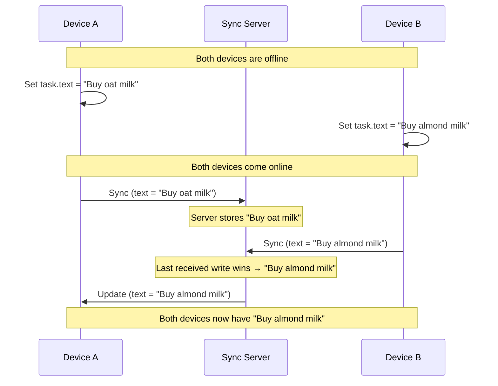
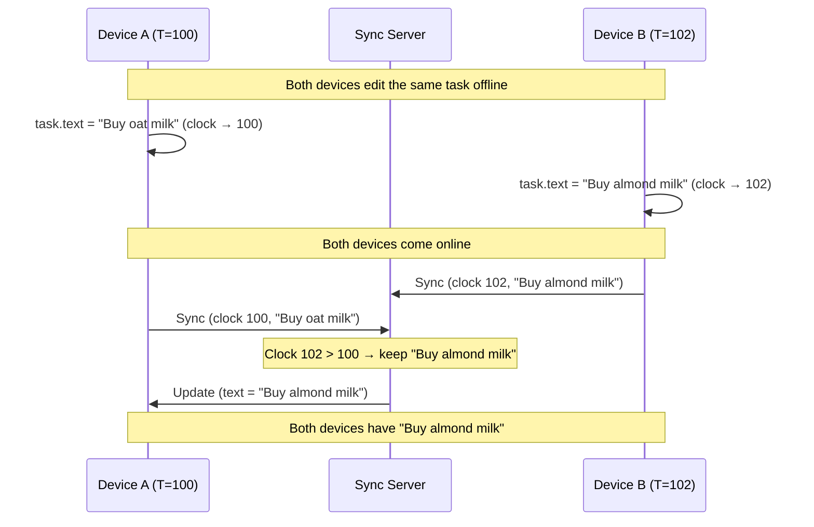
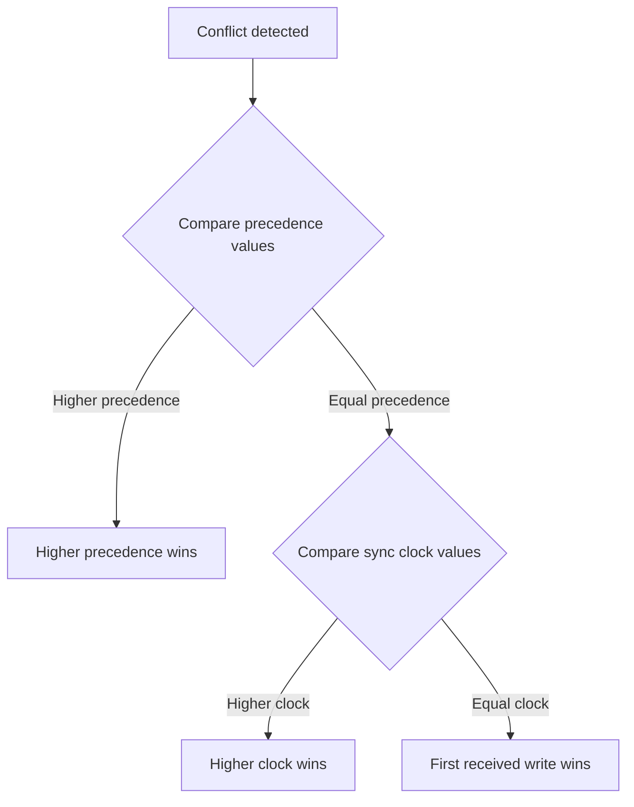
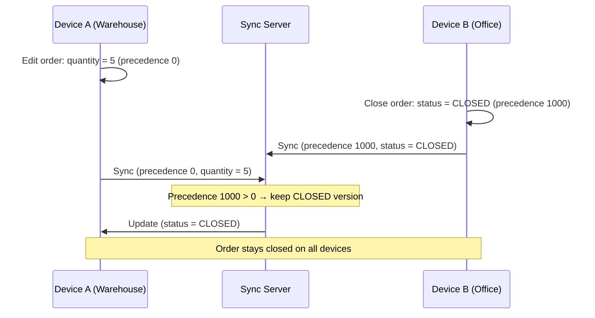

# Syncing Concurrent Changes

Offline-first apps do concurrent updates all the time.
Often, these updates are independent of each other, and they can be applied in any order;
once all devices (Sync clients) sent their individual updates to the Sync server, all data is synced without any issues.

But what happens when **two devices edit the same object** at the same time?
This is a sync conflict, and ObjectBox Sync gives you several ways to handle it.

## Default: Last Received Write Wins

By default, ObjectBox Sync resolves conflicts with a simple rule: **the last write received by the Sync server wins**.
The server processes incoming updates in the order they arrive.
If Device A and Device B both modify the same object while offline, whichever device syncs last will overwrite the other's changes.



This default is easy to reason about but has no notion of "wall-clock time."
A device that was offline for a week and then syncs will overwrite a recent edit simply because its update arrived later.


The default conflict resolution works at the **object level**: when a conflict is detected, the entire object is replaced.


ObjectBox Sync offers two property-level annotations to customize this behavior:

| Annotation          | Purpose                                                           |
|---------------------|-------------------------------------------------------------------|
| **Sync Clock**      | A hybrid logical clock (HLC) that enables true "last write wins." |
| **Sync Precedence** | A developer-assigned priority value: "higher precedence wins."    |

You can use them independently or combine them — when both are present, precedence is compared first, and the sync clock acts as the tie-breaker for equal precedence values.


Rule of thumb: use a sync clock to avoid unexpected overwrites.
E.g., when a device was offline for a long time and then syncs again, its data is likely obsolete.


## Sync Clock

A **sync clock** property is a 64-bit integer that ObjectBox Sync updates automatically on every put operation.
It implements a so-called "Hybrid Logical Clock (HLC)" that combines:

* the **wall clock** (physical time) of the device, and
* a **logical counter** that increments to compensate for clock skew between devices.

This means two devices with different system clocks can still produce a consistent ordering of writes.
On conflict, the write with the **higher clock value wins** — giving you true "last write wins" based on when the change was actually made, not when it was received.


You do not read or set the clock value yourself.
Initialize it to `0` in new objects; ObjectBox Sync takes care of the rest.



HLC clocks still work best if the time on the devices is as accurate as possible.
E.g. allow setting the time automatically in the system settings.
Devices with very different times can lead to unexpected results, so make your support aware of this.


### How It Works



Even though Device A synced **after** Device B, the server keeps Device B's change because its clock value is higher.
Without a sync clock, Device A's later-arriving write would have silently won.

### Defining a Sync Clock Property

Add a `Long` (64-bit integer) property to your synced entity and annotate it as a sync clock.
Initialize it to `0` for new objects.
There can be only **one** sync clock property per entity type.



```java
@Sync
@Entity
public class Task {
    @Id long id;

    String text;

    @SyncClock
    long syncClock = 0;
}
```



```kotlin
@Sync
@Entity
data class Task(
    @Id var id: Long = 0,
    var text: String = "",
    @SyncClock var syncClock: Long = 0
)
```



```dart
@Entity()
@Sync()
class Task {
  @Id()
  int id = 0;

  String text;

  @SyncClock()
  int syncClock = 0;

  Task(this.text);
}
```



```swift
// objectbox: sync
class Task: Entity {
    var id: Id = 0
    var text: String = ""

    // objectbox: syncClock
    var syncClock: Int64 = 0
}
```



```
/// objectbox: sync
table Task {
    id: ulong;
    text: string;

    /// objectbox: sync-clock
    sync_clock: long = 0;
}
```



```go
// `objectbox:"sync"`
type Task struct {
    Id        uint64
    Text      string
    SyncClock int64 `objectbox:"sync-clock"`
}
```



### About the Hybrid Logical Clock (HLC)

A pure wall clock is unreliable in distributed systems — device clocks drift, are set manually, or jump after NTP corrections.
A pure logical clock (like a Lamport clock) gives you ordering but no connection to real time.

The HLC gives you the best of both:

* It **tracks real time** as closely as possible.
* It **never goes backwards**, even if the wall clock is adjusted.
* It uses a **logical counter** to break ties when two events share the same millisecond timestamp.

This makes the sync clock safe to use for conflict resolution without requiring perfectly synchronized clocks across devices.


ObjectBox Sync uses a special HLC implementation with additional compensation for clocks set in the future.
This makes the ObjectBox Sync clock more robust in situations with concurrent offline edits.  


## Sync Precedence

While the sync clock answers "which write happened last?", **sync precedence** answers "which write is more important?"
It is a 64-bit integer property whose value you control.
On conflict, the write with the **higher precedence value wins**.

This is a powerful mechanism for encoding business logic directly into conflict resolution.


Precedence values are an advanced feature that is entirely in your hands.
Assigning them incorrectly can lock out further updates to an object — use with care.


### Defining a Sync Precedence Property

Like the sync clock, there can be only **one** sync precedence property per entity type.



```java
@Sync
@Entity
public class Order {
    @Id long id;

    String item;
    int quantity;

    @SyncPrecedence
    long precedence = 0;

    @SyncClock
    long syncClock = 0;
}
```



```kotlin
@Sync
@Entity
data class Order(
    @Id var id: Long = 0,
    var item: String = "",
    var quantity: Int = 0,
    @SyncPrecedence var precedence: Long = 0,
    @SyncClock var syncClock: Long = 0
)
```



```dart
@Entity()
@Sync()
class Order {
  @Id()
  int id = 0;

  String item;
  int quantity;

  @SyncPrecedence()
  int precedence = 0;

  @SyncClock()
  int syncClock = 0;

  Order(this.item, {this.quantity = 0});
}
```



```swift
// objectbox: sync
class Order: Entity {
    var id: Id = 0
    var item: String = ""
    var quantity: Int = 0

    // objectbox: syncPrecedence
    var precedence: Int64 = 0

    // objectbox: syncClock
    var syncClock: Int64 = 0
}
```



```
/// objectbox: sync
table Order {
    id: ulong;
    item: string;
    quantity: int;

    /// objectbox: sync-precedence
    precedence: long = 0;

    /// objectbox: sync-clock
    sync_clock: long = 0;
}
```



```go
// `objectbox:"sync"`
type Order struct {
    Id         uint64
    Item       string
    Quantity   int32
    Precedence int64 `objectbox:"sync-precedence"`
    SyncClock  int64 `objectbox:"sync-clock"`
}
```



### Conflict Resolution Order

When both a sync precedence and a sync clock are defined on the same entity type, conflicts are resolved as follows:



### Example: Closing an Order

Consider an order-management app where orders can be edited until they are **closed**.
Once closed, no further edits should overwrite the closed state — even if a device with an older, still-open version syncs later.

**Approach:** when closing an order, set the `precedence` property to a high value (e.g. `1000`).
Regular edits keep the default precedence of `0`.



Even though Device A's write arrived later, it cannot overwrite the closed order because its precedence (`0`) is lower than the closing write (`1000`).


Once Device A receives the closed version (with precedence `1000`), subsequent updates from Device A **will** sync again — because they now carry the same or higher precedence.
The sync clock then serves as the tie-breaker.


### More Use Cases for Sync Precedence

**Linear workflow states.**
Model a pipeline where objects move through stages (e.g. `Draft → Review → Approved → Published`).
Assign increasing precedence values to each stage (e.g. 100, 200, 300, 400).
A later stage always wins over an earlier one, preventing accidental rollbacks.


It's generally a good idea to use larger increments like 100 or 1000 for precedence values.
This allows for future extensions to the workflow and introducing values in-between.


**Role-based authority.**
Give admin or manager edits a higher precedence than regular-user edits.
For example, a manager sets precedence to `1000` when overriding a field; normal users leave it at `0`.
This ensures managerial corrections are never silently overwritten by regular edits.

**Checkpoint timestamps.**
Periodically "approve" or "checkpoint" an object by updating its precedence to the current timestamp (e.g. Unix seconds).
Any changes made before the checkpoint that arrive late are discarded because their precedence is lower.
Only changes made after the checkpoint — which naturally carry a higher precedence — will be accepted.


Choose precedence values carefully.
Once an object has a high precedence, only writes with an equal or higher precedence can update it.
Also, avoid `Long.MAX_VALUE` completely.


## Summary

Using a Sync clock is a solid default choice for most apps.

| Mechanism          | Conflict rule              | Controlled by         | Best for                              |
|--------------------|----------------------------|-----------------------|---------------------------------------|
| Default            | Last received write wins   | Arrival order         | Simple apps, non-critical overwrites  |
| Sync Clock (HLC)   | Last actual write wins     | Automatic (ObjectBox) | Fair ordering despite offline periods |
| Sync Precedence    | Higher precedence wins     | Developer             | Business logic (states, roles, locks) |
| Precedence + Clock | Precedence first, then HLC | Both                  | Full control with a sensible fallback |
